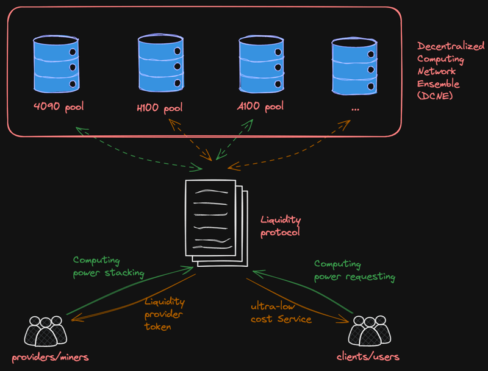
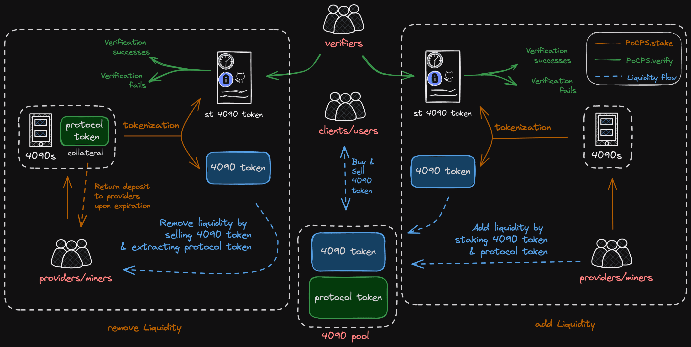
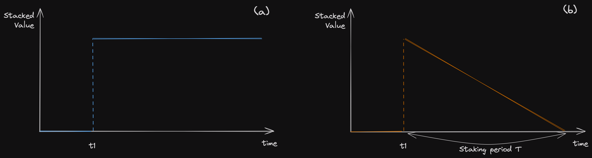
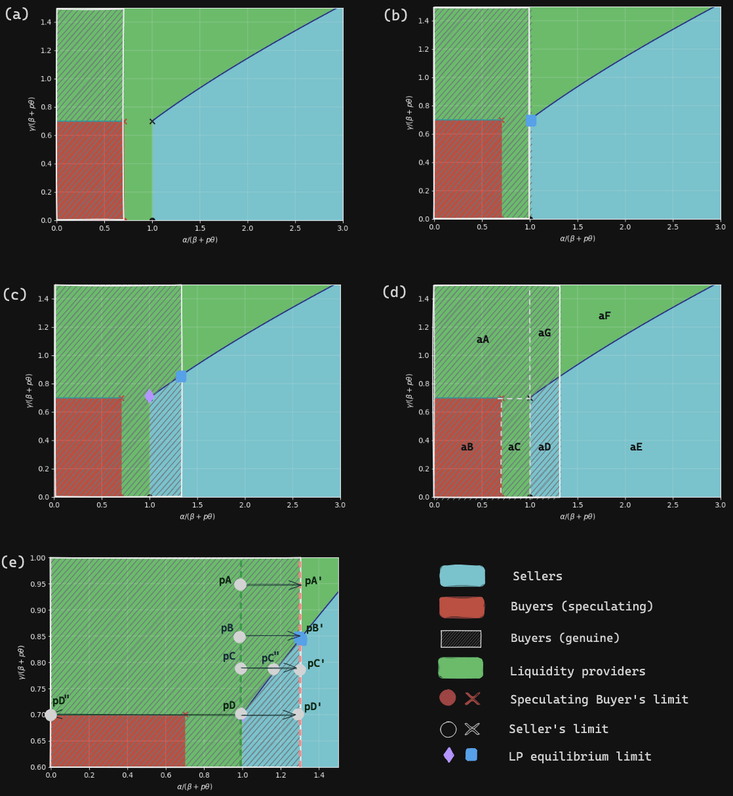

Every legend has its context. None emerges from a vacuum, nor do they fade into obscurity without impact. A true legend isn’t merely powerful; her arrival is impeccably timed—not a moment too soon or too late, which cements her legendary status. This pattern repeats itself in the realm of cryptocurrency. From Bitcoin to Ethereum, from DeFi to DePIN, and now, with PinFi, we witness the rise of legends time and again.

I know you have tens of thousands of doubts and questions swirling through your mind. That’s exactly why I wrote this blog: to thoroughly explain the concept of PinFi. From its inception and theoretical underpinnings to its applications in AI computing and potential impact on asset exchanges, this post covers everything you need to know.

### Exploring PinFi: What It Is and Why It's Essential?

Before we dig deep into PinFi, we need to consider the concept of “dissipative assets”. As its name indicates, a dissipative asset is a type of asset whose value naturally declines over time. Humans, services, electrical power, AI computing power, and hotel rooms all fall into this category. In fact, nearly everything you can think of qualifies as a dissipative asset. That’s right—even your house is a dissipative asset. Without proper maintenance, its value will diminish as time passes.

Computing power, a key type of dissipative asset, is currently a major focus within the DePIN community. Countless teams are diligently working to develop their own decentralized computing networks (DCNs), such as Io.net, Nosana, Render Network, and Akash Network, among others. The growth of DCNs seems limitless, with more entities poised to enter the space and establish their networks.

The primary metric used to showcase the merits of these networks is the number of GPUs each DCN integrates. While the figures are impressive, the underlying reality often tells a different story. A closer inspection reveals minimal utilization of these networks; typically, only about 5% of the GPUs are actively engaged in processing AI tasks. The remaining 95% are largely underutilized, merely serving to bolster the network's claims of capacity. This discrepancy raises important questions about the efficiency and real-world utility of DCNs. Why does this underutilization occur?

The key to understanding the underutilization of DCNs lies in assessing what DCNs can do better than traditional data centers. For training smaller models, such as CNNs, ResNets, or federated learning models, extensive parallel GPU use is not essential. As long as the GPUs provide sufficient TFLOPS and vRAM, these models can be effectively trained. This also applies to fine-tuning and inference with these smaller models, where DCNs should prove to be beneficial.

However, training modern large language models (LLMs) with DCNs presents challenges. Typically, it’s not the TFLOPS of GPUs that limit this process, but rather the bandwidth availability. State-of-the-art GPU training clusters rely on rail-optimized, any-to-any clos networks, which are critical for high-performance model training. To enhance inter-domain bandwidth, RDMA NICs capable of 100Gbps are essential. Furthermore, efficient job schedulers like Pollux, Themis, or Cassini are crucial to manage resources effectively. The absence of high-bandwidth connections and sophisticated scheduling schemes significantly restricts the usefulness of DCNs in training complex models.

The principal advantages of DCNs over traditional data centers are twofold: (1) they provide reliable and censorship-resistant services, and (2) they offer cost-effectiveness for training, fine-tuning, and inference of small models, as well as for fine-tuning and inference of large models. Any DCN naturally meets the first criterion, provided that its job scheduling algorithm is sufficiently competent. However, the second advantage is compromised by the prevalent pricing model in existing DCNs—a centralized order book that implies infinite liquidity at a single price. This pricing model leads to underutilization and inliquidity of resources.

To attract more users to decentralized computing networks (DCNs), the pricing of computing resources needs to be competitive. However, it is equally important to ensure that the pricing isn't so low as to deter GPU providers from connecting to the network. The equilibrium between these two stakeholders establishes the true market price for these resources. To facilitate this dynamic pricing, it is crucial to implement a market-making mechanism within DCNs. The most effective approach is to integrate the automated market-making systems commonly used in the decentralized finance world into DCNs. This is precisely the role of PinFi. In summary, PinFi represents the convergence of decentralized personal computing (DePIN) and decentralized finance (DeFi). Mathmatically PinFi = DeFi(DePin).

### How Does LooPIN Function?

The bird's eye view of the LooPIN network, the first project based on PinFi protocol, is illustrated in the figure below. This diagram provides a comprehensive overview of how  decentralized finance (DeFi) merges with DCNs to enhance system efficiency and resource utilization.

The LooPIN network is underpinned by several critical components, each contributing to its innovative and decentralized architecture:

1. **Liquidity Pools.** Central to our network are the liquidity pools, differentiated by the type of computing power resource they represent (e.g., GPUs, and potentially in the future, TPUs or Groq chips). These pools are designed to be permissionless and resistant to censorship, enabling anyone to establish a liquidity pool on the blockchain via our smart contracts.
2. **Decentralized Computing Network Ensemble (DCNE).** The aggregation of these permissionless liquidity pools, contributed by a variety of independent computing providers, forms what we refer to as the Decentralized Computing Network Ensemble (DCNE). This can be thought of as a 'network of networks', representing a new layer of decentralized computing infrastructure.
3. **Providers/Miners.** Miners are users who contribute to the LooPIN network by providing Devices and staking the token to a designated liquidity pool. Through participating in the Proof-of-Computing-Power-Staking process, Miners validate their continuous contribution of computing power, available for Client use. At predetermined epochs, Miners are awarded block rewards, proportional to their contribution and the protocol's governance.
4. **Clients/Users.** Clients engage with the LooPIN network by utilizing computing resources from specific liquidity pools. Similar to Miners, Clients are eligible for block rewards at designated epochs, acknowledging their participation and contribution to the network's computational demands.
5. **Verifiers**. Integral to maintaining the integrity of the LooPIN network, verifiers play a crucial role in assessing the operational status of devices. Leveraging the Proof-of-Computing-Power-Staking scheme, verifiers are empowered to efficiently validate that devices not only claim to, but actually do, provide secure and reliable services to clients.

Figure 1: This diagram shows how PinFi merges DCNs and DeFi to optimize resource utilization and pricing in DCNs.

To understand how the LooPIN system enhances liquidity in Decentralized Computing Networks (DCNs), consider the scenario of a resource holder possessing computing resources. In typical DCNs, this seller cannot immediately sell his computing resources; he must list his resources on the network and wait until someone rents his GPUs. Until such a rental occurs, he cannot monetize his resources. In contrast, the LooPIN system allows him to monetize immediately. By injecting his resources into the corresponding liquidity pool, not only does he monetize, but he also earns rewards.

Figure 2 provides a detailed illustration of how LooPIN operates. It depicts a miner with an NVIDIA RTX 4090 GPU who stakes this asset in the LooPIN Decentralized Computing Network Ensemble (DCNE) for two hours. The staking process involves the following steps:

1. **Token Burn and Certificate Issuance**: Miners destroy a designated quantity of tokens to receive a burn token certificate, marking their initial commitment to the network.
2. **Certificate Deposit and Token Allocation**: By depositing this certificate along with a maintenance fee (waived for miners opting to be liquidity providers) into a smart contract address, miners are allocated two tokens: the st-4090-token, a non-tradable, non-fungible token acting as proof of liquidity provision with a 2-hour validity, and the 4090-token, whose existence is tied to the st-4090-token's lifespan.
3. **Liquidity Injection**: Contributing the 4090-token and an equivalent utility token amount enhances the 4090 pool's liquidity. At the st-4090-token's expiration, two key events occur: the miner receives rewards for staking computing resources and utility tokens are automatically returned to the miner at the prevailing exchange rate.
4. **Liquidity Removal**: Miners may opt to sell their 4090-token to the pool for utility tokens, incurring an exchange fee. Upon expiration of the st-4090-token—and pending successful interactive verification—the maintenance fee is refunded.

Figure 2: An illustration of the scheme of LooPIN.

### PinFi vs DeFi: Understanding the differences.

In traditional decentralized finance (DeFi) environments, liquidity pools comprising token pairs, such as A and B, exhibit a static quality in the absence of external interactions. This means that the token quantities within these pools are not influenced by the passage of time, *t*, remaining constant unless affected by transactions or other forms of engagement. The invariant nature of these token pairs is a hallmark of conventional DeFi liquidity pools, where the absence of activity does not alter the balance of assets. In the DeFi senerio, a liquidity injection can be illustrated as  Figure 3(a).

Contrastingly, the PinFi protocol introduces a paradigm shift with its innovative approach to liquidity pools, distinguishing itself from the traditional models prevalent in conventional DeFi. Within PinFi's framework, one of the tokens in the liquidity pool represents the total staked computing power hours—a dynamic and dissipative asset whose value inherently declines over time, *t*, reflecting the consumptive nature of computing resources. The other token in the pool is the protocol token, serving as the stable counterpart in this pair. Considering a simplified liquidity injection event for a PinFi system, shown in the Figure 3(b).

Figure 3: The conservative principles underlying decentralized finance (DeFi) systems (a), juxtaposed with the inherently dissipative dynamics of physical infrastructure finance (PinFi) systems (b).

This distinction complicates the implementation of the PinFi protocol within smart contracts. To ensure the protocol's stability and sustainability, rigorous research is essential. A critical element of the protocol’s effectiveness and market efficiency is the role of liquidity providers (LPs). Several challenges need addressing to stabilize the protocol: LPs may prefer selling in external markets rather than participating within the PinFi system; they might choose to sell their assets rather than contribute as LPs; and there is a risk LPs are reluctant to engage within the protocol itself.

Our research indicates that, assuming participant integrity and under common conditions, the PinFi protocol can maintain a dynamic equilibrium among LPs, sellers, and buyers. The rewards offered to LPs must be carefully balanced: too low, and LPs opt to sell their computing resources for non-dissipative tokens rather than serve as LPs; too high, and it leads to a scarcity of sellers, disrupting the market balance. The intricate dynamics among LPs, buyers, and sellers are further detailed in Figure 4 and elaborated in our recent game-theory paper (see [[https://arxiv.org/pdf/2404.02174.pdf](https://arxiv.org/pdf/2404.02174.pdf)]).

Figure 4: Phase Diagrams Illustrating the Dynamics and Equilibria in Dissipative Asset Pricing.

### Next steps for PinFi & LooPIN

The conception stage has been realized through two publications and a beta test. Even in our beta test, the core components of the protocol are on-chain, ensuring exceptional fairness across the ecosystem. We plan to gradually transition all off-chain elements to their on-chain equivalents. Additional technical papers, including those focusing on the development of the scheduling mechanisms within the LooPIN network, will be available soon.