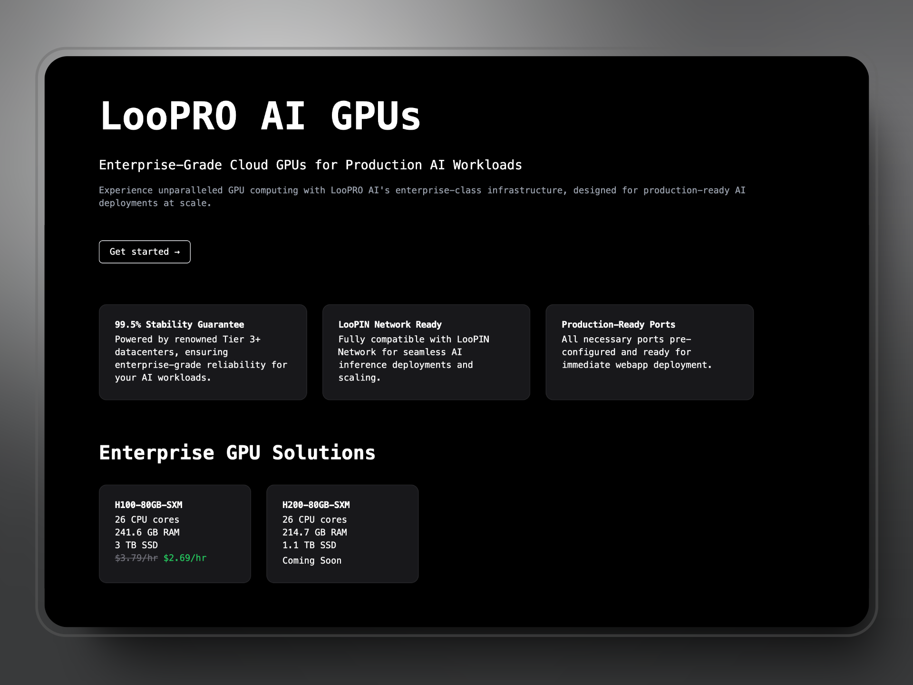
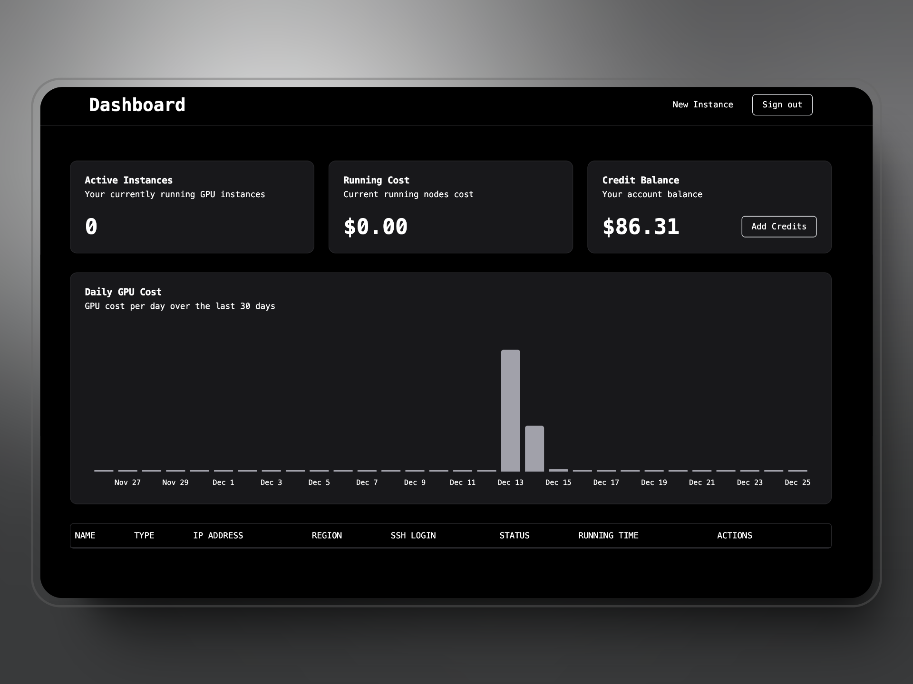
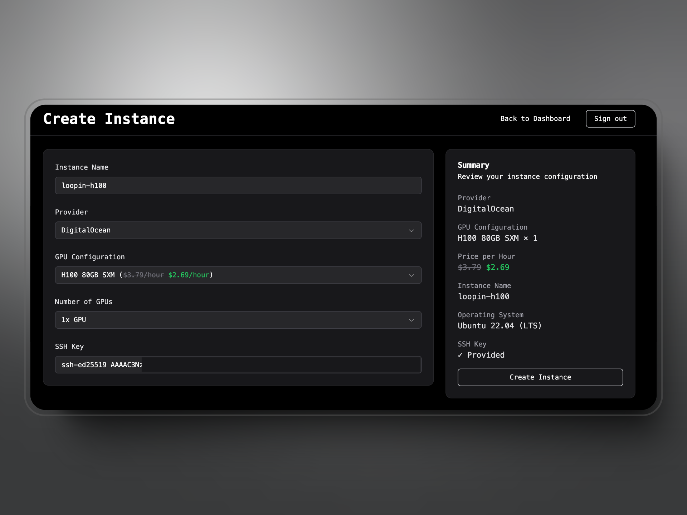
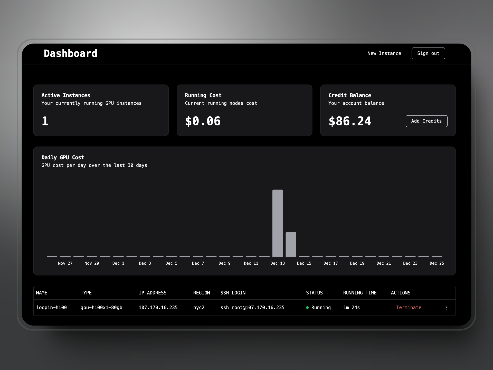

# LooPro AI



## How to register and use LooPro AI

The whole process is pretty straightforward. You need to go to the [LooPro AI dashboard](https://app.loopro.ai), and register or login with your Google account. This account doesn't need to be the same as the account you have in LooPIN network.

After clicking the button to get started, you'll be directed to the Google login page and redirected to the dashboard upon successful login.



On the dashboard, you'll see:
- Your current active instance count
- Real-time cost for all running instances
- Credit balance in your account
- Daily GPU costs visualization for the last 30 days
- List of all your running instances

## How to add credits

1. Click the `Add Credits` button on the [dashboard](https://app.loopro.ai/dashboard)
2. Choose the amount of credits you would like to add
3. Complete payment through the Stripe payment page
   - Currently, only fiat money payments are supported for secure cloud instance access
4. After successful payment, you'll be redirected to the dashboard with your refreshed credit balance

## How to create a new instance



1. Click the `New Instance` button in the top right of the [dashboard](https://app.loopro.ai/dashboard)
2. Enter the instance information:
   - Instance Name
   - Provider (default: DigitalOcean)
   - GPU Configuration (e.g., H100 80GB SXM)
   - Number of GPUs (e.g., 1x GPU)
3. Add your SSH public key
   - If you need to generate a new SSH key pair, refer to the [Git documentation](https://git-scm.com/book/en/v2/Git-on-the-Server-Generating-Your-SSH-Public-Key)
   - Input the complete SSH public key string (e.g., `ssh-rsa AAAAB3Nzaxxxx`)
4. Click create instance
5. Once successful, you'll be redirected to the dashboard

After creation, you can use the assigned IP and your SSH key to access the remote instance.



## How to terminate an instance

1. Select the instance you want to terminate from the dashboard
2. Confirm the termination warning
   - Note: All data on the instance will be erased and cannot be recovered after termination
3. After confirmation, your instance will be terminated
4. No further costs will be charged for terminated instances

## Connect your LooPro AI Instance to LooPIN Network

### Prerequisites

Before you get started, ensure you meet the following requirements:

- A stable network connection and open ports for cluster access.
- An **Ubuntu system** with **Nvidia GPUs** installed, as currently, LooPIN only supports this configuration.

### Steps to Join LooPIN

1. **Register on LooPIN**: Head over to [loopin.network](https://loopin.network) and sign up using your email or Google account.
2. **Prepare Your Machine**: Ensure you have a bare metal machine with an Nvidia GPU. Navigate to the "server" section on the navbar and click on "Deploy a new machine".
3. **CLI Worker Registration**:
 - Open a terminal on your Ubuntu system.
 - Run the following command to register your machine as a LooPIN worker (Find it in your guidance page):
```bash
curl -fsSL https://files.loopin.network/install.sh | sudo bash -s -- --code <your-unique-code>
```
 - This command downloads and executes the LooPIN installation script, registering your machine with the provided unique code.
4. **Installation and Verification**: The script will check if your machine meets the requirements and will install necessary drivers, including the Nvidia GPU driver. It will then verify your setup and register your worker. Upon successful installation, you should see the message:
```bash
LooPIN Client Connected! Waiting for the on-chain verification...
```
This indicates that the client application is installed and awaiting connection. The first-time connection may take approximately 5-10 minutes, depending on your network speed.

5. **Join the Cluster**: Once your machine connects to our cluster and shows an online tag, you are ready to contribute your idle GPU hours to the pool or engage in liquidity swapping.

### What You'll Need

For a smooth setup, ensure you have:

- **A stable internet connection** to download necessary files and communicate with the LooPIN network.
- **An Ubuntu system with Nvidia GPUs**: This is crucial for the hardware compatibility with LooPIN's requirements.

By following these steps, you'll be fully set to start leveraging your hardware on the LooPIN network.

Go to [Liquidity Tutorial](docs/quick-start/liquidity.mdx) and [Swap Tutorial](docs/quick-start/swap.mdx) for more.

