# How to Bridge Your Token Between Solana and Ethereum

## Understanding Tokens on Solana and Ethereum

Our tokens on Ethereum and Solana are both standard native tokens. On Ethereum, we build our ERC20 token based on the [OpenZeppelin ERC20.sol contract](https://github.com/OpenZeppelin/openzeppelin-contracts/blob/master/contracts/token/ERC20/ERC20.sol). On Solana, we utilize the [standard Solana-program-library peer-reviewed token contract](https://github.com/solana-labs/solana-program-library/tree/master/token/program). As standard native tokens on both chains, they are compatible with all token ecosystems in DeFi protocols, ensuring safety and interoperability.

We plan to migrate our Solana devnet token to mainnet while maintaining the same tokenomics structure. Daily token minting will continue on Solana, with distribution handled by the treasury account. Token holders will have the freedom to bridge their tokens between Solana and Ethereum using our official bridge, supported by the [Wormhole team](https://wormhole.com/).

## Understanding the Bridge

We utilize the Native Token Transfers (NTT) protocol for our cross-chain applications. NTT is an open framework enabling seamless creation and transfer of multichain tokens while maintaining ownership and contract upgradability across blockchains. Developed by the Wormhole team, NTT is now widely adopted in Solana-EVM cross-chain applications, including Lido, Jito, and EtherFi.

For more information on NTT, visit the [official NTT page](https://wormhole.com/products/native-token-transfers) or refer to their [FAQ](https://wormhole.com/docs/build/contract-integrations/native-token-transfers/faqs/).

## Step-by-Step Guide: Bridging Your Token from Solana to Ethereum

### Prerequisites:
1. A Solana wallet (source wallet)
2. An Ethereum wallet (destination wallet)
3. Sufficient SOL and ETH in respective wallets for gas fees

Note: This guide uses Phantom wallet for Solana and MetaMask for Ethereum as examples.

### Steps:

1. Navigate to https://loopin.network/bridge

2. Connect Source Wallet (Solana):
- Click "Connect source wallet"
- Choose Phantom wallet
- Confirm connection if prompted

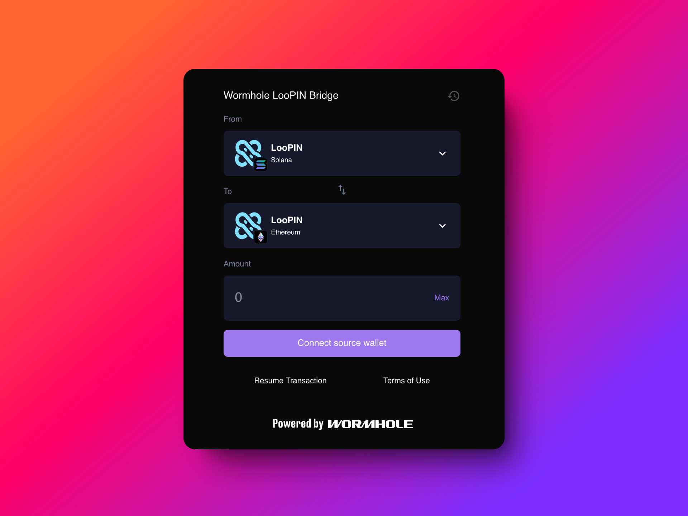

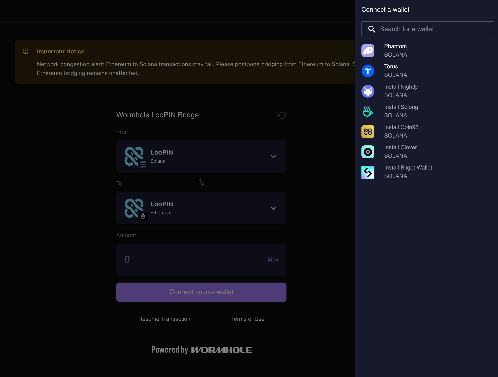

3. Connect Destination Wallet (Ethereum):
- Click "Connect destination wallet"
- Choose MetaMask

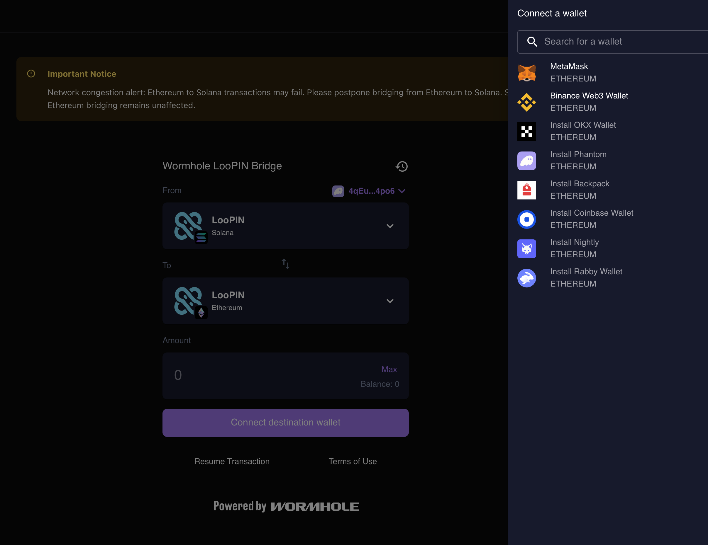

4. Verify Wallet Addresses:
- Ensure both wallet addresses are correctly displayed

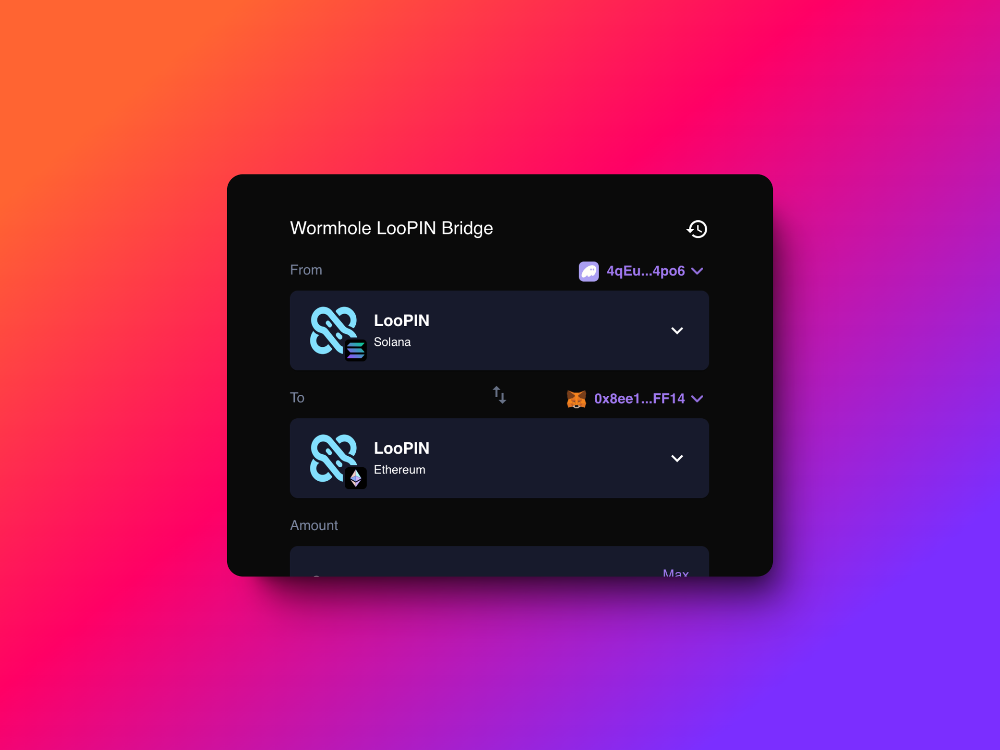

5. Initiate Token Transfer:
- Enter the amount of LooPIN to bridge
- Wait for the route to load
- Click "Review transaction"

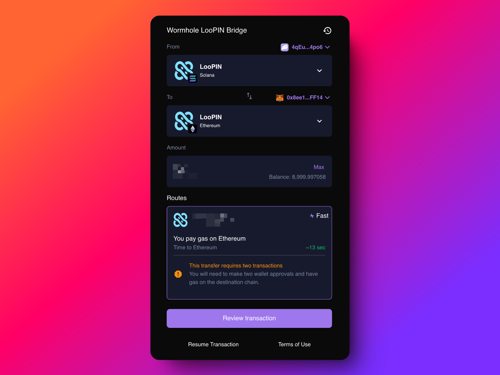

6. Confirm Transaction:
- Review estimated time
- Click to confirm the transaction

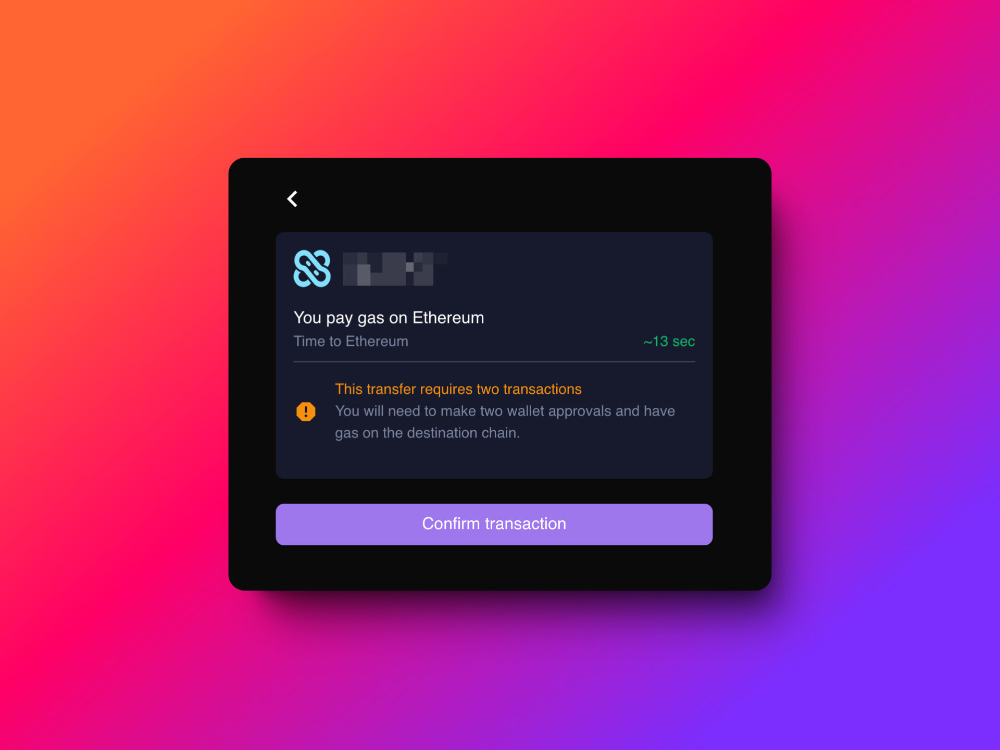

7. Sign the Transaction:
- Wait for the Phantom wallet signature request
- Sign the transaction

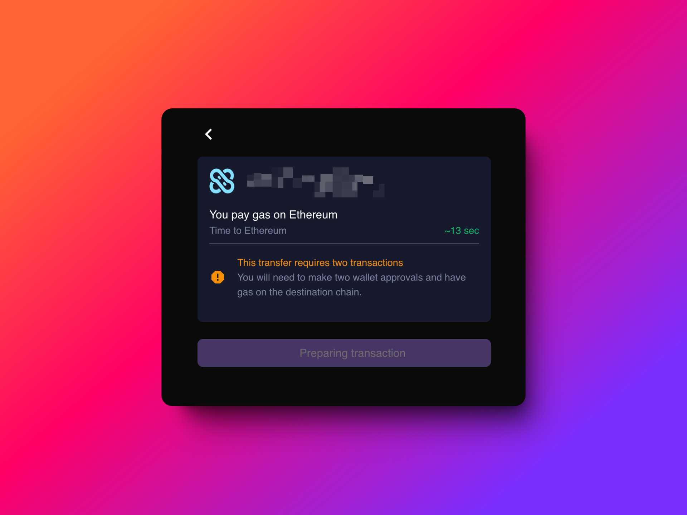

8. Wait for Processing:
- Transaction typically takes 10-20 seconds (Solana to ETH)
- Note: ETH to Solana can take up to 20 minutes. Close this page to prevent RPC overload. Then use the ‘Resume Transaction’ function to continue your claim.

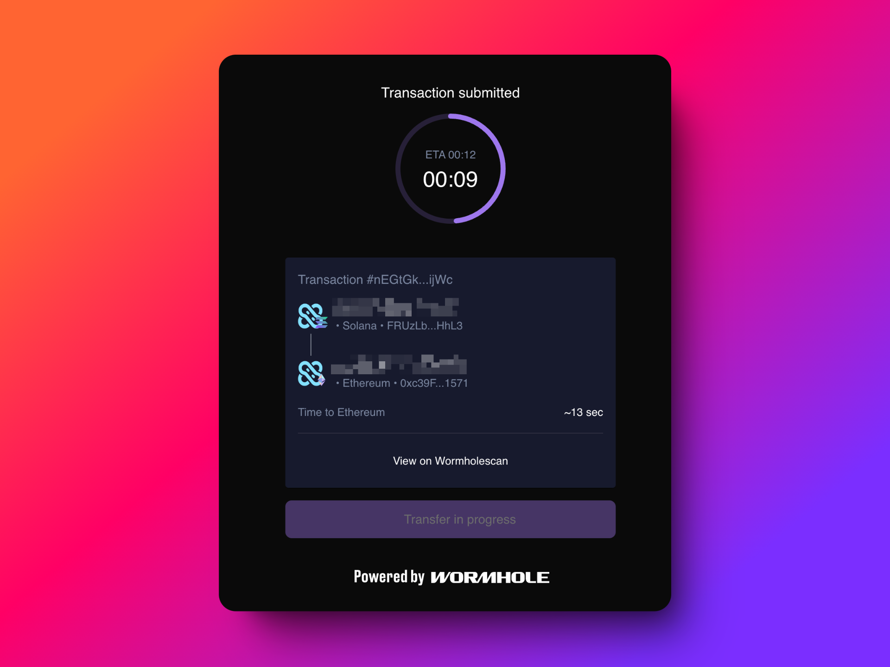

9. Claim Tokens on Ethereum:
- When ready, click to claim tokens
- Sign the confirmation in MetaMask

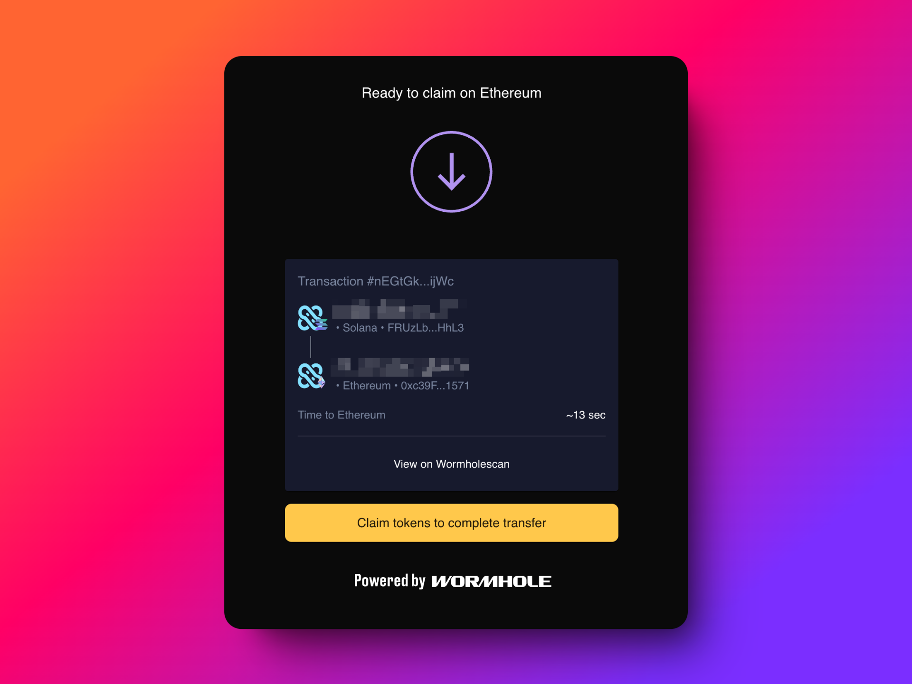

10. Verify Completion:
- Check your Ethereum wallet for the bridged LooPIN tokens (ERC20)

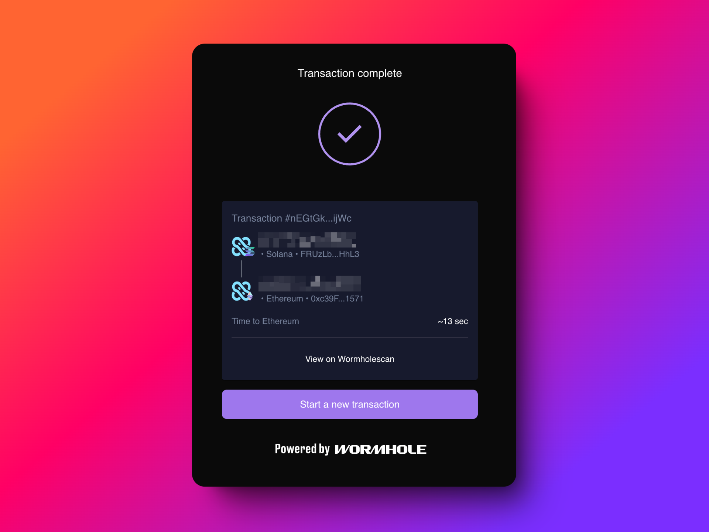

If you encounter any issues, you can view the transaction on Wormholescan and reach out to our team or the Wormhole team for assistance.

By following these steps, you can successfully bridge your LooPIN tokens from Solana to Ethereum. Always ensure you're using official platforms and be cautious of gas fees during the process.

## How to Resume a Cross-Chain Transaction from Ethereum to Solana

When initiating a cross-chain transaction from Ethereum (ETH) to Solana, the process can take up to 20 minutes. This guide will walk you through how to resume an unfinished transaction if you need to close the page during this waiting period.

### Step 1: Initiate the Transaction

1. Start your ETH to Solana transaction as usual.
2. When you reach the countdown page, you can safely close it.

### Step 2: Locate Your Recent Transaction

1. When you're ready to resume (preferably close to the 20-minute mark), look for the most recent transaction button in the upper right corner of the interface.
2. Click on this button to view your recent transactions.

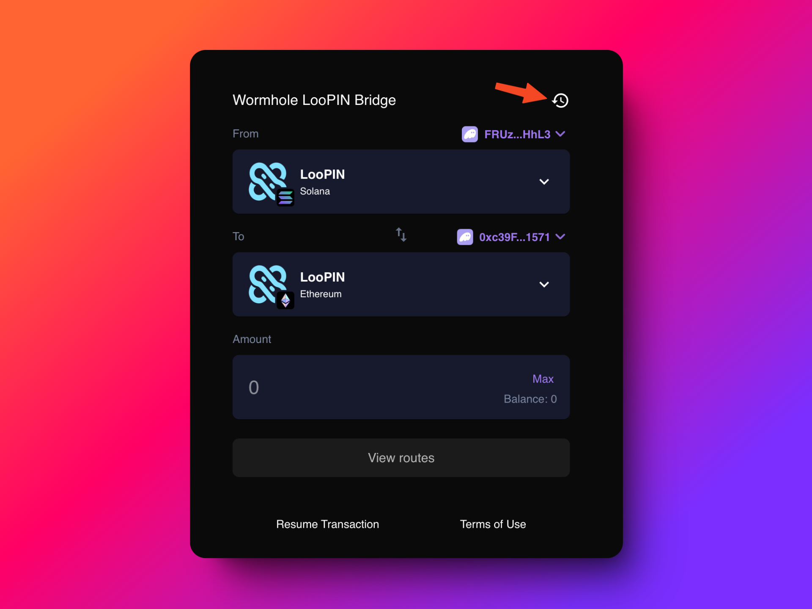

3. Find and click on your most recent transaction.
4. This will reveal the Wormhole transaction ID (txid).

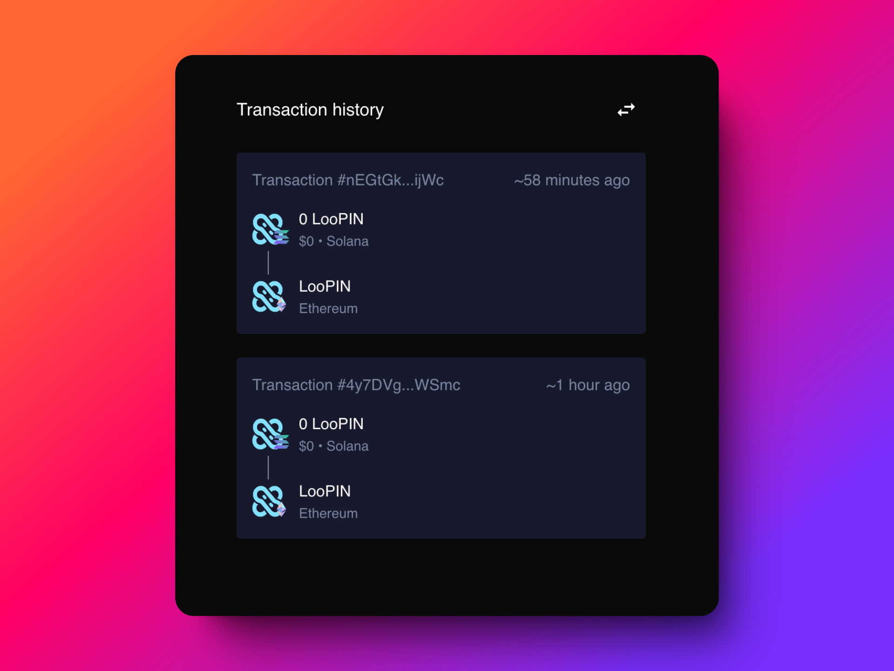

### Step 3: Resume the Transaction

1. Navigate to the "Resume Transaction" section of the platform.
2. Enter your Wormhole transaction ID to fetch the unfinished claim.
3. Use the source chain (Ethereum in this case) along with the transaction hash to resume the process.

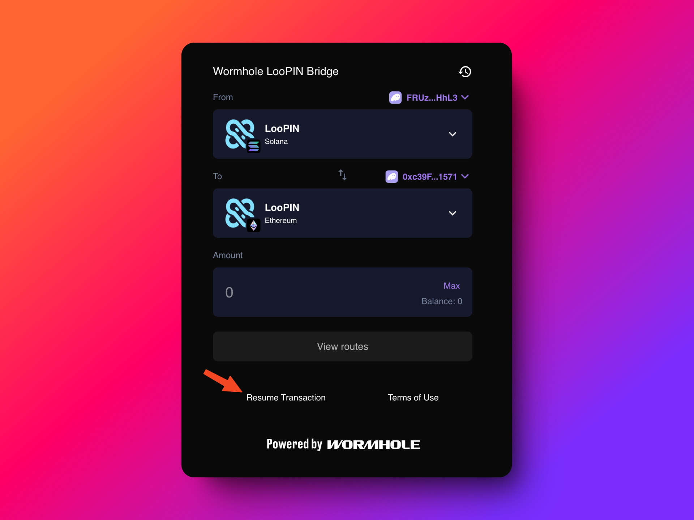

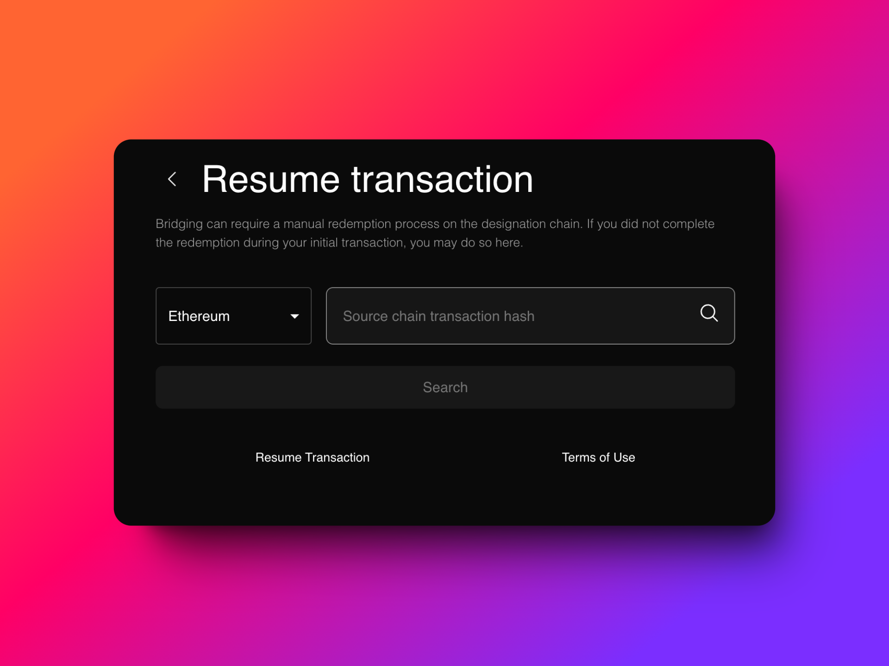

### Important Notes:

1. **Network Congestion**: Bridging from Ethereum to Solana may experience longer network congestion. Please be patient during the transaction.

2. **Avoiding Overload**: During the 20-minute waiting period, it's recommended to close the transaction page to prevent potential overload of the system.

3. **Solana Claim Process**: When claiming on Solana, you may need to sign 3-5 separate signatures. Each signature may take 15-30 seconds to process.

By following these steps, you can easily resume your cross-chain transaction from Ethereum to Solana, ensuring a smooth transfer of your assets even if you need to step away during the process.