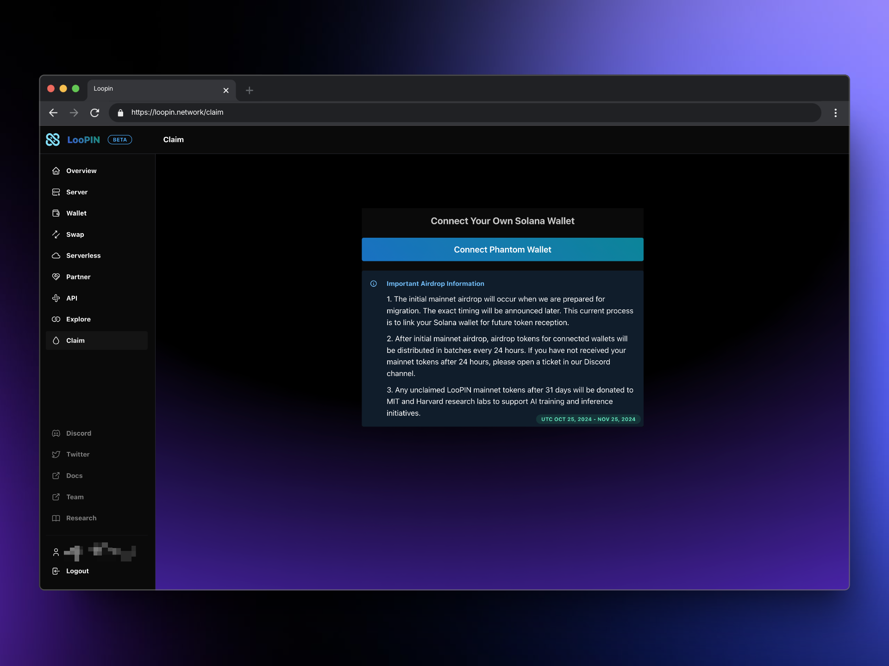
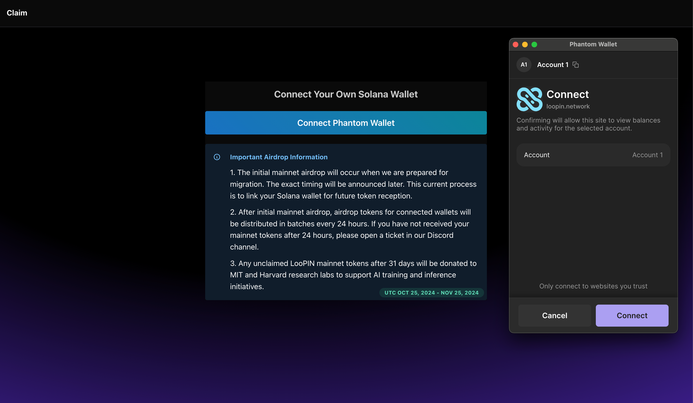
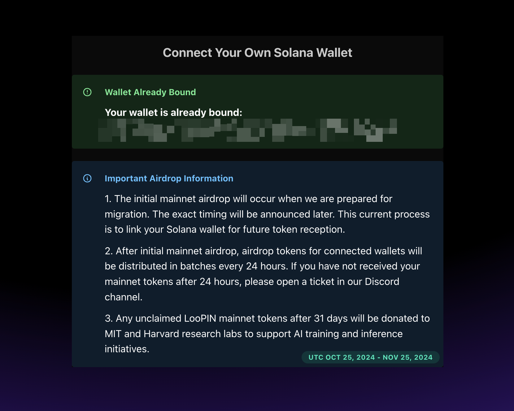

# How to Bind Your Solana Wallet to Your LooPIN Network Account

As we approach the launch of our mainnet, all current LooPIN users are required to bind their Solana wallet through Phantom to be eligible for the initial mainnet airdrop. The date for this airdrop will be announced soon. To ensure you receive the mainnet tokens in the first batch, please bind your Solana wallet as soon as possible. Wallets bound after the initial mainnet airdrop will receive their tokens in 24-hour block batches.

## Prerequisites

1. An active LooPIN account ( register at https://loopin.network )
2. Phantom wallet installed ( https://phantom.app/ )
- You can install the Phantom wallet as a Chrome or Firefox extension from https://phantom.app/download
- Follow the official guide to set up a new wallet or import an existing one: https://phantom.app/learn/guides/how-to-create-a-new-wallet

## Binding Your Solana Wallet to Your LooPIN Account

1. Log in to your LooPIN account and navigate to the claim page at https://loopin.network/claim

2. Click the `Connect Phantom Wallet` button in the center of the page. You'll see a confirmation pop-up in your Phantom wallet to connect to the LooPIN network.

3. In your Phantom wallet, click "Connect" to authorize LooPIN to access your Solana wallet address.

4. If successful, you'll see a connection success message and your wallet address displayed on the page.

5. Refresh the page to confirm that your account is now bound to your Solana wallet.

## Frequently Asked Questions

1. **Can I disconnect my Solana wallet and reconnect with another wallet on the mainnet claim page?**
No, you can only connect once. After connection, you cannot change the bound wallet for the mainnet airdrop. If you need to change your airdrop wallet for any reason, please open a ticket in Discord to contact the team for assistance.

2. **Can I bind more than one wallet to my LooPIN account?**
No, you can only bind one wallet to your LooPIN account. All testnet tokens will be converted to mainnet tokens and sent to your bound wallet when we announce the mainnet launch.

3. **Can I link one wallet address to multiple Loopin accounts?**
Yes, you can. These wallets are just for receiving mainnet tokens when we launch. If you've connected several Loopin accounts to one wallet, you'll see multiple transactions during the mainnet switch.

4. **What if I don't connect my wallet before the initial mainnet airdrop?**
Don't worry if you miss the first mainnet airdrop. You have 31 days to connect your wallet and receive the mainnet tokens. If you connect your wallet within this period, you may need to wait up to 24 hours to receive your tokens. If you don't receive your tokens within 24 hours, please contact the team on Discord for assistance. If you exceed the 31-day deadline, your tokens will be sent as a gratitude gift to MIT and Harvard research labs for AI training and inference purposes.

5. **Where can I find more information about the Phantom wallet?**
You can find useful information at https://phantom.app/learn/guides and https://phantom.app/learn/crypto-101. For wallet-specific questions, you can reach out to the Phantom official team for help at https://help.phantom.app/hc/en-us

Remember, binding your Solana wallet is crucial for receiving your mainnet tokens. If you encounter any issues during the process, don't hesitate to reach out to the LooPIN team on Discord for support.