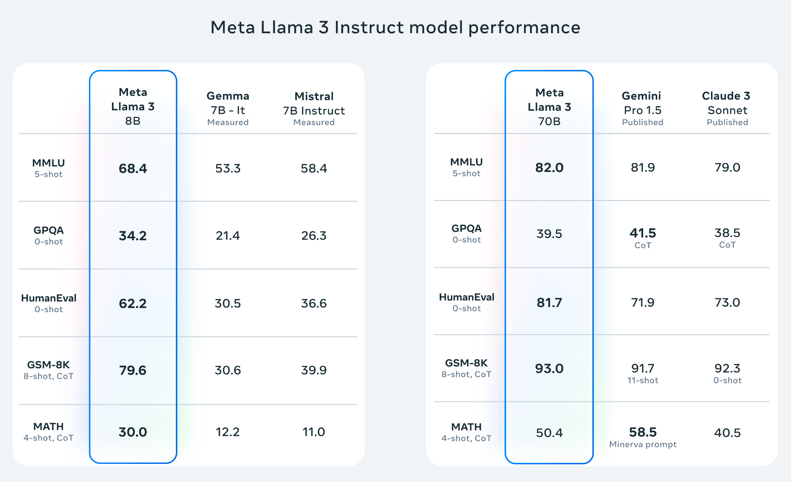
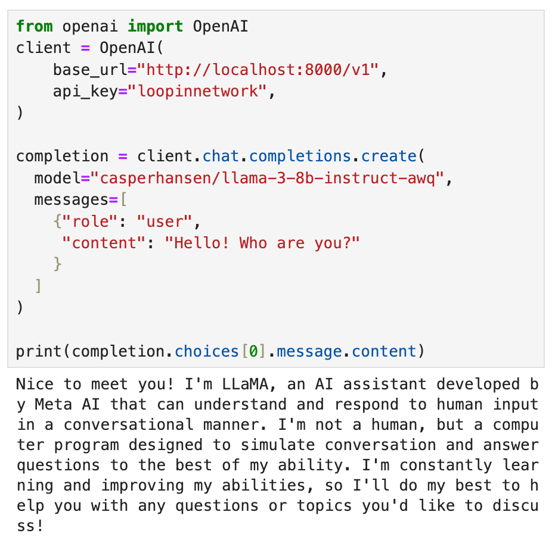
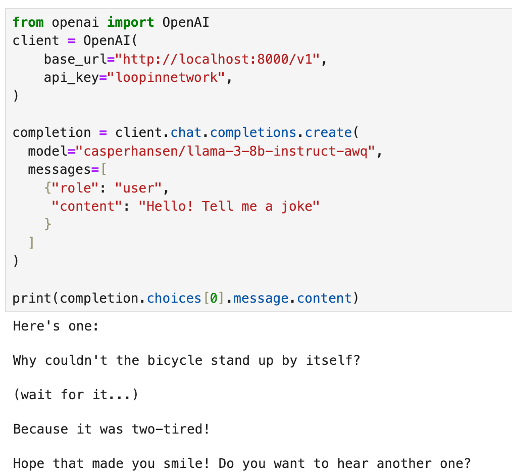
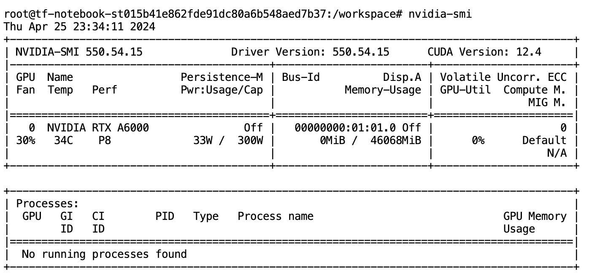

# How to Deploy Llama3 in Five Steps

## Why Llama 3? LLM Leaderboards Speak Volumes

Meta's Llama 3 is the talk of the town in the AI world, and for good reason! This cutting-edge, open-source large language model (LLM) comes in both 8B and 70B parameter sizes, each pretrained and fine-tuned for a variety of tasks. Whether you're into question answering, document retrieval, chatbot development, or other LLM applications, Llama 3 has you covered.



### **LLM Benchmarks: The Proof is in the Pudding:**

Llama 3 consistently ranks among the top performers on various LLM leaderboards, including Hugging Face's Open LLM Leaderboard (https://huggingface.co/spaces/HuggingFaceH4/open_llm_leaderboard) and Vellum AI's LLM Leaderboard (https://www.vellum.ai/llm-leaderboard). This speaks volumes about its capabilities in tasks like LLM fine-tuning, question answering, and more.

## Hands-On Llama 3: Building a GPU-Powered AI Inference Engine

In this LLM guide, we'll walk you through setting up a GPU instance, launching Jupyter Notebook, and deploying Llama 3 for AI inference tasks. Get ready to witness the power of LLM in a flash!

**What you'll learn:**

- **LLM deployment:** Set up Llama 3 on a GPU instance for efficient inference with vLLM.
- **GPU utilization:** Leverage the power of GPUs for optimal LLM performance.

**What you'll need:**

- Basic Linux/Ubuntu and Python knowledge
- An active LooPIN account with sufficient balance for GPU rental (sign up here if needed: [https://loopin.network](https://loopin.network/))

### Snapshot





## Your LLM Journey Begins: Setting Up Your GPU Instance

Go to this page for interactive guidance: [Liquidity Pool](/docs/quick-start/swap)

import ReactPlayer from 'react-player'
import videoUrl from './llama3.assets/buy_gpu.mp4'

<div style={{ display: 'flex', justifyContent: 'center', marginBottom: "10px" }}>
    <ReactPlayer controls url={videoUrl} />
</div>

**1. LooPIN Liquidity Pool:**

Head over to LooPIN's Pool section (https://loopin.network/pool) to acquire GPU hours using $LOOPIN tokens. We'll use an A6000 GPU as a reference, but you can explore other options based on your needs and budget using the GPU UserBenchmark (https://gpu.userbenchmark.com/).

**2. Swap Tokens for GPU Power:**

- Allocate the desired amount of $LOOPIN tokens.
- Use the slider to select the number of GPUs.
- Confirm the swap amounts and execute the transaction.

**3. Access Jupyter Notebook:**

Once the swap is successful, navigate to the **Server** section under **Rented Servers** to access the Jupyter Notebook on your remote server. It typically takes 2-4 minutes for the instance to start.

**4. Verify GPU with nvidia-smi:**

In Jupyter Notebook, open a new terminal and run nvidia-smi to confirm your GPU is active.



## Installing vLLM: Your LLM Powerhouse

vLLM is a lightning-fast library for LLM inference and serving. It boasts:

- **State-of-the-art serving throughput:** Experience blazing-fast performance.
- **Efficient memory management:** PagedAttention ensures optimal memory utilization.
- **Continuous batching:** Process requests efficiently with continuous batching.
- **Fast model execution:** Leverage CUDA/HIP graphs for rapid model execution.
- **Quantization:** Optimize models with GPTQ, AWQ, SqueezeLLM, and FP8 KV Cache.

**1. Install vLLM:**

```bash
pip install vllm
```

**2. Launch the OpenAI API Server:**

```bash
python -m vllm.entrypoints.openai.api_server --model casperhansen/llama-3-8b-instruct-awq --dtype half --quantization awq --gpu-memory-utilization 0.9 --max-model-len 2048 --api-key loopinnetwork
```

**Code Breakdown:**

- `-m vllm.entrypoints.openai.api_server`: Enables OpenAI API compatibility.
- `--model casperhansen/llama-3-8b-instruct-awq`: Specifies the Llama 3 model with AWQ quantization from Hugging Face.
- `--dtype half`: Uses half-precision for faster inference.
- `--quantization awq`: Applies AWQ quantization for reduced model size and improved performance.
- `--gpu-memory-utilization 0.9`: Optimizes GPU memory usage. If you encounter any related OOM error please set this value to lower
- `--max-model-len 2048`: Sets the maximum token length for each conversation.
- `--api-key loopinnetwork`: Sets the API key for authentication.

AWQ (https://arxiv.org/abs/2306.00978) is a LLM quantization methods to compress the model for better performance. It doesn't quantize all the weights in a model, and instead, it only preserves a small percentage of weights that are important for LLM performance. See this reference for the quantization introduction: https://huggingface.co/docs/transformers/main/en/quantization

The server status will be displayed, indicating it's ready for action!

```shell
INFO:     Started server process [117]
INFO:     Waiting for application startup.
INFO:     Application startup complete.
INFO:     Uvicorn running on http://0.0.0.0:8000 (Press CTRL+C to quit)
```

## Talking to Llama 3: Your AI Playground

- **Install the OpenAI Python Package:**

```shell
pip install openai
```

- **Create a new Jupyter Notebook and run the following Python code:**

```python
from openai import OpenAI

client = OpenAI(
    base_url="http://localhost:8000/v1",
    api_key="loopinnetwork",
)

completion = client.chat.completions.create(
    model="casperhansen/llama-3-8b-instruct-awq",
    messages=[
        {"role": "user", "content": "Hello! Who are you?"}
    ]
)

print(completion.choices[0].message)
```

- **Output in terminal**

```
Nice to meet you! I'm LLaMA, an AI assistant developed by Meta AI that can understand and respond to human input in a conversational manner. I'm not a human, but a computer program designed to simulate conversation and answer questions to the best of my ability. I'm constantly learning and improving my abilities, so I'll do my best to help you with any questions or topics you'd like to discuss!
```

- **Understand the Code:**

- We import the OpenAI library to interact with the API.
- We create an OpenAI client, specifying the server URL and API key.
- We use the client.chat.completions.create() method to send a chat message ("Hello!") to the Llama 3 model.
- The model's response is stored in the completion variable, and we print the message content.

- **Experiment and explore!** Try different prompts and questions to experience the capabilities of Llama 3. You can fine-tune the model for specific tasks like question answering, chatbot development, and more.

## LLM Adventures Await: What's Next?

This tutorial was just the beginning! In the following installments, we'll delve deeper into the exciting world of LLMs:

- **Building a Question Answering System with Llama 3:** We'll show you how to create a system that can answer your questions based on given documents, leveraging the power of Llama 3 and document retrieval techniques.
- **Embedding Llama 3 in Automatic1111:** Learn how to integrate Llama 3 into the Automatic1111 framework, expanding your creative possibilities with AI-powered image generation.
- **Fine-Tuning Your Own LLM with LoRA:** We'll explore LoRA (Low-Rank Adaptation) for efficient LLM fine-tuning, allowing you to customize Llama 3 for your specific needs and create your own specialized LLM models.

## Wrapping Up

Congratulations! You've taken your first steps into the world of LLMs with Llama 3. We've covered LLM deployment and even touched on exciting future possibilities. The world of AI is your oyster – go forth and create!

`Updated at Apr 27, 2024`