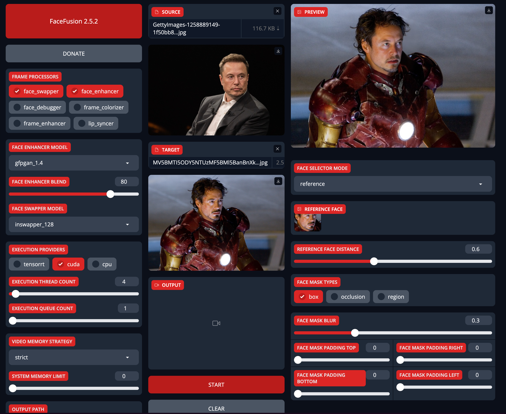

# FaceFusion: Usage Guide

FaceFusion introduces the latest generation of AI face swapping tools, operable directly through a one-click interface without the need for installation. This tool supports obstruction removal, high-definition processing, and cartoon face replacement across all major graphics card platforms, including Nvidia and AMD. The updated version enhances image and video face swapping quality through advanced models and algorithms and introduces three new mask functions to improve fusion results and address issues related to facial obstructions.

## Preparation

This tutorial will guide you through setting face swapping parameters using Facefusion, utilizing the following open-source library:

### Facefusion AI Face Swap Tool

FaceFusion: [Facefusion GitHub](https://github.com/facefusion/facefusion)

The tool facilitates one-click operations to perform tasks such as obstruction removal and high-definition face transformation, supported across major graphics card platforms.

## Installation Guide

Please refer to the previous article for detailed installation instructions of `Facefusion` [Install guidance](facefusion). This document will focus on the usage of different parameters via the `Gradio` interface.

## AI Face Swap Tutorial

### Single Face Replacement Process

Key settings include:

- **FaceSwap**: Enabled by default to allow face swapping.
- **FaceDebug**: Useful for debugging during mask application; not required under normal operations.
- **Face_enhancer**: Commonly used to enhance the clarity of swapped faces in videos. Default setting: `GFPGAN1.4`.
- **Frame_enhancer**: Enhances image quality; usage on non-RTX4090 graphics cards is not recommended due to performance impact.
- **Face Swapper Model**: `InSwapper_128` is the default model and is suitable for various scenarios.
- **Execution Provider**: Accelerates face swapping; use CPU for AMD graphics and integrated graphics, CUDA for Nvidia.
- **Execution Thread Count**: Adjust according to available video memory; default is recommended if unspecified.
- **Execution Queue Count**: Necessary for batch operations via scripts; not required for web interface use.
- **Output path**: Stores temporary images during the swapping process; these are automatically deleted post-operation.
- **Options**: Includes settings to skip downloads, retain temporary images, and exclude audio from output videos, tailored to user preferences.

To perform a swap, select a clear frontal face photo and the target photo, view the preview, and initiate the swap by clicking the 'Start' button. For enhanced clarity, enable `Face_enhancer` and perform the swap again.

### Video Face Swap and Related Parameter Settings

Select the desired video for face replacement, and click on the face detected to preview the effect. For optimal results, apply facial enhancements and use the recommended default settings of `InSwapper128` and `GFPGAN1.4` for the face swap model and high-definition processing.

Adjust the `Execution Thread Count` based on the current usage of video memory to improve performance. Ensure that the original video frame rate is maintained and that the download step is skipped by checking the appropriate options. For videos with clear, unobstructed faces, the default parameter settings on the right are adequate. If processing speed is an issue, increase the `Execution Thread Count` to 12.

Face detection operates by default from left to right, replacing the first detected face. The interface lists detected faces on the right, allowing you to change which face is replaced by clicking on the corresponding icon. You can choose to replace 'many' to change all detected faces, or 'one' to change only the first detected face.

The `REFERENCE FACE DISTANCE` setting typically works well at the default value of 0.6. For videos featuring faces at sharp angles or partially obscured, adjust this parameter up to a maximum of 1.5 to ensure any detected face is replaced, improving the matching accuracy.

Demo video:

import ReactPlayer from 'react-player'
import videoUrl from './facefusion-usage.assets/elon-tiktok-dance.mp4'

    <ReactPlayer controls url={videoUrl} />

### Use of Mask Functions

To optimize facial fusion in videos with obstructing objects, select a suitable mask mode and activate FaceDebug to assess the effects before finalizing settings. The default Box mode displays as a green square. For facial obstructions like makeup, opt for the `occlusion` mode, which allows adjusting the `Face Mask Blur`—typically set at 0.3—to modify the transparency of obstructions; values above 0.5 are recommended for less transparency.

After adjustments, deactivate FaceDebug to prevent mask outlines from appearing in the final video. In `occlusion` mode, the blur setting may require adjustments, especially for transparent objects such as glasses, where a lower blur value often enhances realism.

The `region` mask mode offers specific controls for facial areas like eyebrows, nose, eyes, and mouth, automatically set to replace unless manually deselected (e.g., uncheck Mouth for videos with frequent mouth movements).

Both `occlusion` and `region` modes provide parameters—`FACE MASK PADDING TOP`, `FACE MASK PADDING RIGHT`, `FACE MASK PADDING BOTTOM`, and `FACE MASK PADDING LEFT`—to adjust the boundaries of the face replacement area. Increasing these values expands the non-replacement zone from the respective sides of the face. For videos obscured by Box masks, especially over subtitles, adjust the `FACE MASK PADDING BOTTOM` to clear the subtitle area, confirming the adjustment with FaceDebug before proceeding with the replacement.

### High-Definition and Cartoon Face Replacement

In high-definition videos with close-up face shots, adjusting the `Face Detector Size` to a resolution as high as 1024 is beneficial for detailed analysis. For these instances, activating facial enhancement and opting for the `codeformer` algorithm over `GFPGAN1.4` is advised to achieve more authentic skin textures, enhancing the realism of the facial features.

For cartoon face replacements, switch from the `InSwapper_128` model to `simswap_256`, and enable the `face_enhancer` to focus enhancements on the eyes, nose, and mouth. This selective enhancement preserves the original appearance of other facial areas, ensuring that only the key features are modified for a natural integration into the cartoon style.

## Summary

This guide provides comprehensive instructions for using FaceFusion's AI face swap capabilities, from installation to advanced usage tips for video and high-resolution content.

`Updated at May 4, 2024`