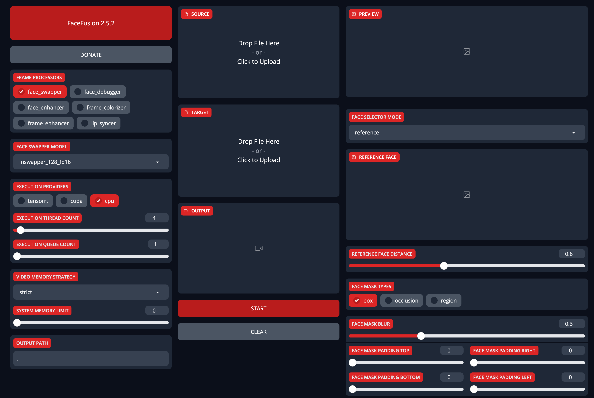

# AI Face Swapping: Guide for FaceFusion

**FaceFusion**, the next generation tool for AI-driven face swapping and enhancement, has gained popularity for its user-friendly interface and superior performance, especially after the discontinuation of **Deepfacelive** updates. This blog post provides a comprehensive guide on deploying the latest version of **FaceFusion** on cloud GPUs and fine-tuning face swapping parameters for various AI-driven face transformation effects.

## Project Preview


## Preparation

This tutorial will guide you through setting up the environment, installing the **FaceFusion** Python package, preparing materials, and fine-tuning the parameters.

### FaceFusion AI Face Swapping Tool

**FaceFusion**, a cutting-edge AI face swapping tool, operates with a one-click setup and supports obstacle removal, high-definition enhancement, and cartoon face swaps. It is compatible with various graphics cards, including Nvidia and AMD, making it ideal for diverse platforms.

## Installation Tutorial

### Configure GPU Instance

For detailed interactive guidance, please visit the [LooPIN Liquidity Pool](/docs/quick-start/swap).

**1. LooPIN Liquidity Pool:**

Initially, access the LooPIN liquidity pool ([LooPIN Network Pool](https://loopin.network/pool)), where you can utilize $LOOPIN tokens to acquire GPU time. Select the RTX 3080 GPU, or choose the most appropriate GPU model based on your requirements and budget from [GPU UserBenchmark](https://gpu.userbenchmark.com/).

**2. Token Exchange for GPU Resources:**

- Choose your desired quantity of $LOOPIN tokens.
- Adjust the slider to select the required number of GPUs.
- Confirm your selections and finalize the transaction.

**3. Access Jupyter Notebook:**

Upon completing the transaction, proceed to the **Rented Servers** section and select **Server** to access the Jupyter Notebook via a remote server. Typically, the setup takes 2-4 minutes.

**4. Verify GPU Activation:**

In Jupyter Notebook, open a terminal and execute the `nvidia-smi` command to ensure the GPU is activated properly.

```shell
+-----------------------------------------------------------------------------------------+
| NVIDIA-SMI 550.54.15              Driver Version: 550.54.15      CUDA Version: 12.4     |
|-----------------------------------------+------------------------+----------------------+
| GPU  Name                 Persistence-M | Bus-Id          Disp.A | Volatile Uncorr. ECC |
| Fan  Temp   Perf          Pwr:Usage/Cap |           Memory-Usage | GPU-Util  Compute M. |
|                                         |                        |               MIG M. |
|=========================================+========================+======================|
|   0  NVIDIA GeForce RTX 3080        Off |   00000000:01:00.0 Off |                  N/A |
|  0%   39C    P8             21W /  350W |      12MiB /  12288MiB |      0%      Default |
|                                         |                        |                  N/A |
+-----------------------------------------+------------------------+----------------------+

+-----------------------------------------------------------------------------------------+
| Processes:                                                                              |
|  GPU   GI   CI        PID   Type   Process name                              GPU Memory |
|        ID   ID                                                               Usage      |
|=========================================================================================|
+-----------------------------------------------------------------------------------------+
```

### Install `FaceFusion` Dependencies

1. Install `ffmpeg`:

```shell
apt update && apt install ffmpeg
```

2. Install `conda`:

```shell
curl -LO https://repo.anaconda.com/miniconda/Miniconda3-latest-Linux-x86_64.sh
bash Miniconda3-latest-Linux-x86_64.sh
```

Restart your terminal to apply the conda installation settings.

3. Download and Install `FaceFusion`:

```shell
git clone https://github.com/facefusion/facefusion
cd facefusion
python install.py  # Installs dependencies including the latest `onnxruntime` for CUDA 12.2
```

4. Launch `FaceFusion`:

```shell
python run.py  # Start the service, accessible locally at: http://127.0.0.1:7860
```

### Enable Public Access via Gradio

Gradio is a library for building interactive machine learning model interfaces without frontend coding. This setup maps the internal network port 7860 to the internet.

In the `facefusion/uis/layouts/` directory, create `share.py`:

```python
import gradio

from facefusion.uis.layouts import default


def pre_check() -> bool:
    return default.pre_check()


def pre_render() -> bool:
    return default.pre_render()


def render() -> gradio.Blocks:
    return default.render()


def listen() -> None:
    default.listen()


def run(ui : gradio.Blocks) -> None:
    ui.launch(show_api = False, share = True)
```

Restart `run.py` with modified settings to enable public access:

```shell
python run.py --ui-layouts share
```

Upon completion, you can access the **FaceFusion** interface via a unique URL.

```shell
Running on local URL: http://127.0.0.1:7860
Running on public URL: https://e41b4898c4fad7cc83.gradio.live

This share link expires in 72 hours. For free permanent hosting and GPU upgrades, run `gradio deploy` from Terminal to deploy to Spaces (https://huggingface.co/spaces)
```



## Summary

- **FaceFusion** offers a user-friendly, high-performance AI tool for face swapping and enhancement.
- The installation guide provides detailed steps for setting up GPUs, installing necessary software, and starting the FaceFusion service.
- **Gradio** facilitates the creation of visual and easy-to-use web interfaces for **FaceFusion**, enhancing user experience and accessibility.

- Necessary links and resources, including the GitHub repository and GPU evaluation tools, are provided for further assistance.