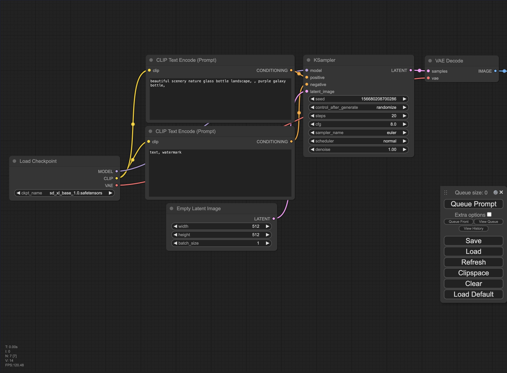
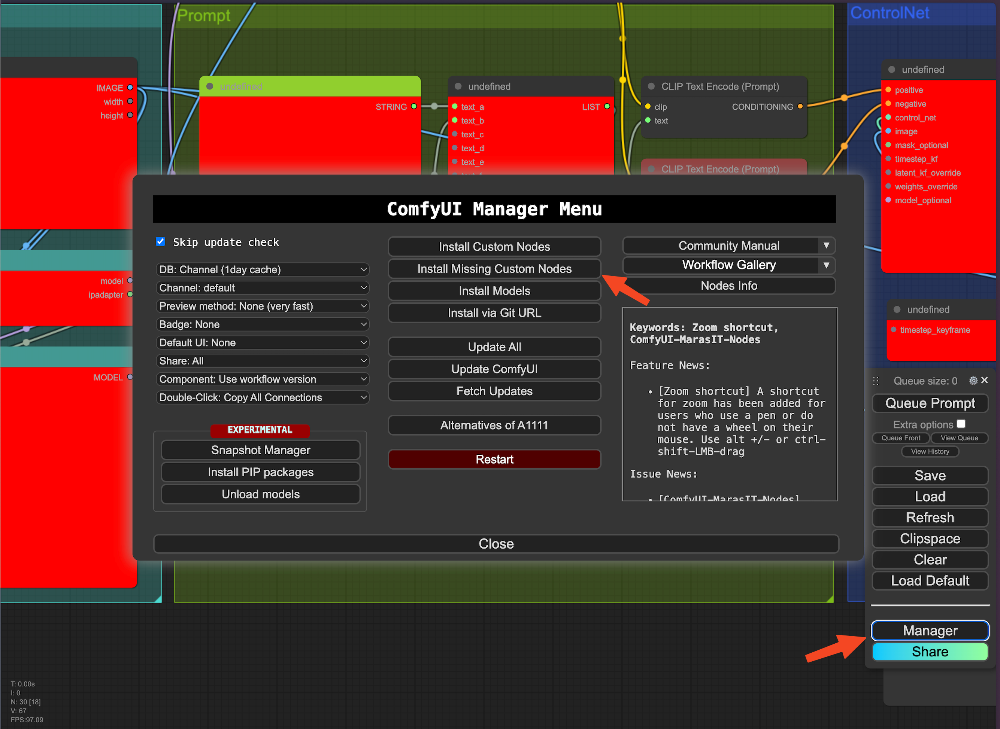
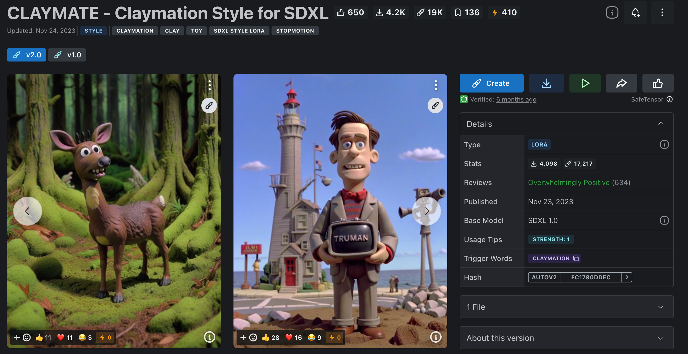
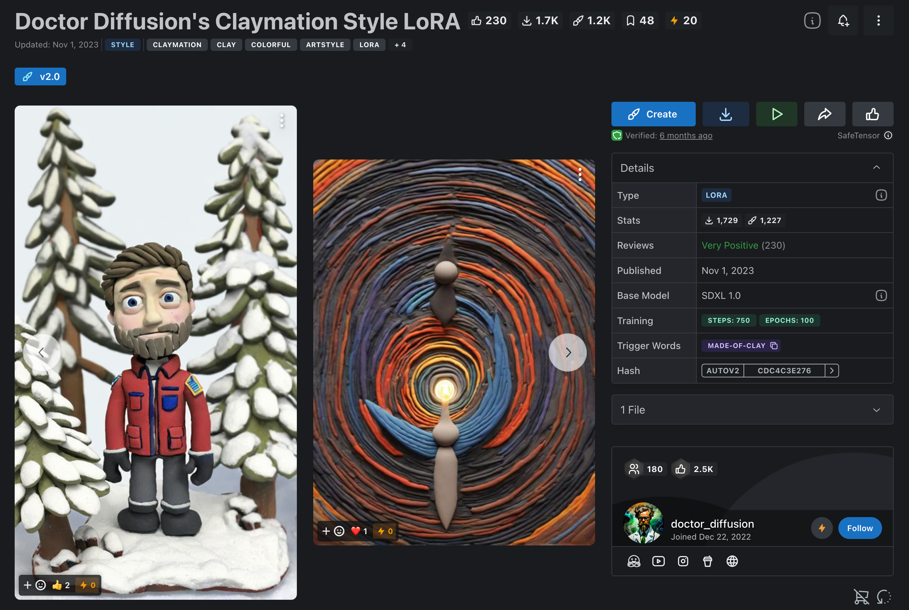
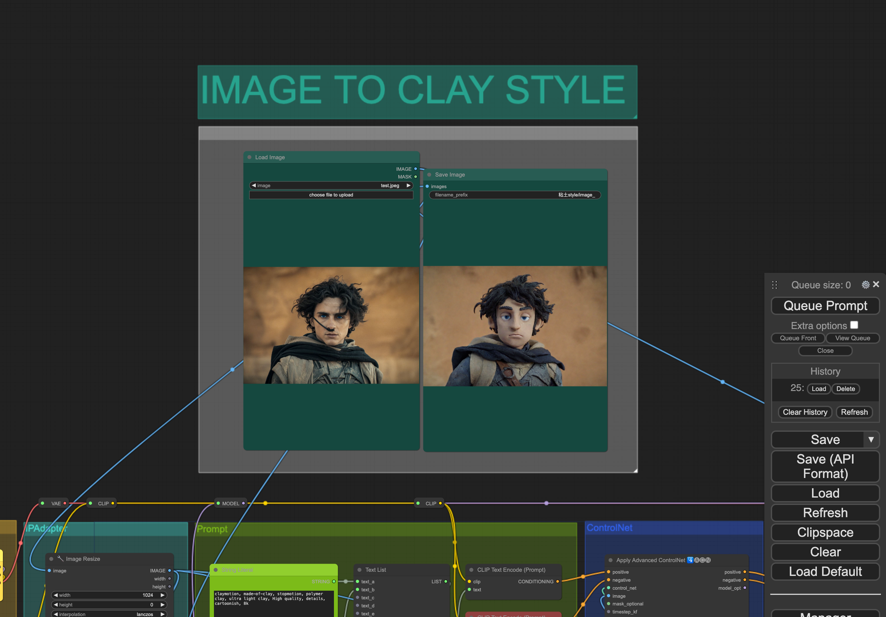

# ComfyUI | How to Implement Clay Style Filters

This guide will introduce you to deploying `Stable Diffusion`'s `Comfy UI` on `LooPIN` with a single click, and to the initial experiences with the clay style filter. `Comfy UI` employs a node-based operational approach, offering enhanced control, easier replication, and fine-tuning of the output results, and allows for the customization of personalized workflows upon mastery.

> 🔥NEW🔥 If you want to try it first, go to our interactive demo: 👉🏻 [Clay Style Demo](/playground/comfyui-clay-demo)


## Introduction to ComfyUI

`Comfy UI` utilizes a node-based operation approach. It offers better support for the `Stable Diffusion XL 1.0` model compared to other WebUIs, allowing visible workflow integration of different models (such as the Base model and the Refiner model). This node-based approach increases controllability, facilitating replication and fine-tuning of output results, and enabling the customization of personalized workflows after proficiency is attained.

## Installation of ComfyUI Nodes

### Configuring GPU Instances

For detailed interactive guidance, please visit the following page: [LooPIN Liquidity Pool](/docs/quick-start/swap)

**1. LooPIN Liquidity Pool:**

Navigate to LooPIN's liquidity pool ([LooPIN Network Pool](https://loopin.network/pool)), and use $LOOPIN tokens to purchase GPU time. As an example, select the appropriate GPU model based on your requirements and budget from [GPU UserBenchmark](https://gpu.userbenchmark.com/).

**2. Token Exchange for GPU Resources:**

- Select the necessary quantity of $LOOPIN tokens.
- Adjust the slider to choose the number of GPUs.
- Confirm the exchange amount and finalize the transaction.

**3. Accessing Jupyter Notebook:**

Following a successful transaction, access the Jupyter Notebook via your remote server under **Rented Servers** and **Server**. Usually, the instance is ready within 2-4 minutes.

**4. Verifying GPU Activation:**

Within the Jupyter Notebook, launch a new terminal window, execute the `nvidia-smi` command, and verify if the GPU is active.

```shell
+-----------------------------------------------------------------------------------------+
| NVIDIA-SMI 550.54.15              Driver Version: 550.54.15      CUDA Version: 12.4     |
|-----------------------------------------+------------------------+----------------------+
| GPU  Name                 Persistence-M | Bus-Id          Disp.A | Volatile Uncorr. ECC |
| Fan  Temp   Perf          Pwr:Usage/Cap |           Memory-Usage | GPU-Util  Compute M. |
|                                         |                        |               MIG M. |
|=========================================+========================+======================|
|   0  NVIDIA GeForce RTX 3080        Off |   00000000:01:00.0 Off |                  N/A |
|  0%   39C    P8             21W /  350W |      12MiB /  12288MiB |      0%      Default |
|                                         |                        |                  N/A |
+-----------------------------------------+------------------------+----------------------+

+-----------------------------------------------------------------------------------------+
| Processes:                                                                              |
|  GPU   GI   CI        PID   Type   Process name                              GPU Memory |
|        ID   ID                                                               Usage      |
|=========================================================================================|
+-----------------------------------------------------------------------------------------+
```

### Installation Process for ComfyUI

1. Install the `Comfy UI` GitHub package:

```shell
git clone https://github.com/comfyanonymous/ComfyUI.git && cd ComfyUI
```

2. Install Python dependencies:

```shell
pip install xformers!=0.0.18 -r requirements.txt --extra-index-url https://download.pytorch.org/whl/cu121 --extra-index-url https://download.pytorch.org/whl/cu118 --extra-index-url https://download.pytorch.org/whl/cu117
```

3. Install `ComfyUI-Manager`, an extension designed to enhance `Comfy UI` user experiences. It includes management functions for installing, removing, disabling, and enabling `Comfy UI`'s various custom nodes.

```shell
cd /workspace/ComfyUI/custom_nodes
git clone https://github.com/ltdrdata/ComfyUI-Manager.git
```

4. Download and install the Cloudflare tunnel:

```shell
wget https://github.com/cloudflare/cloudflared/releases/latest/download/cloudflared-linux-amd64.deb
dpkg -i cloudflared-linux-amd64.deb
```

5. Create a new `Jupyter Notebook` in `Comfy UI`, and expose the port using `Cloudflare`. Await the output of the internal network penetration link from `Cloudflare`.

```python
import subprocess
import threading
import time
import socket
import urllib.request

def iframe_thread(port):
  while True:
      time.sleep(0.5)
      sock = socket.socket(socket.AF_INET, socket.SOCK_STREAM)
      result = sock.connect_ex(('127.0.0.1', port))
      if result == 0:
        break
      sock.close()
  print("\nComfyUI finished loading, trying to launch cloudflared (if it gets stuck here cloudflared is having issues)\n")

  p = subprocess.Popen(["cloudflared", "tunnel", "--url", "http://127.0.0.1:{}".format(port)], stdout=subprocess.PIPE, stderr=subprocess.PIPE)
  for line in p.stderr:
    l = line.decode()
    if "trycloudflare.com " in l:
      print("This is the URL to access ComfyUI:", l[l.find("http"):], end='')
    #print(l, end='')


threading.Thread(target=iframe_thread, daemon=True, args=(8188,)).start()

!python main.py --dont-print-server
```

```shell
xformers version: 0.0.26.post1+cu118
Set vram state to: NORMAL_VRAM
Device: cuda:0 NVIDIA GeForce RTX 3080 : cudaMallocAsync
VAE dtype: torch.bfloat16
Using pytorch cross attention
****** User settings have been changed to be stored on the server instead of browser storage. ******
****** For multi-user setups add the --multi-user CLI argument to enable multiple user profiles. ******

Import times for custom nodes:
   0.0 seconds: /workspace/ComfyUI/custom_nodes/websocket_image_save.py


ComfyUI finished loading, trying to launch cloudflared (if it gets stuck here cloudflared is having issues)

This is the URL to access ComfyUI: https://inside-isa-myrtle-guardian.trycloudflare.com
```

Click on the following link to access ComfyUI: `https://inside-isa-myrtle-guardian.trycloudflare.com`. If it fails to load initially, please allow 1-2 minutes.



### Clay Style Workflow Installation

1. Loading the Clay Style Workflow:

Utilize the `XIONGMU` open-source `Comfy UI` workflow from (https://openart.ai/workflows/xiongmu/image-to-clay-style/KRjSiOFyPSHO5QCQ4raV) and select Load in `Comfy UI` after downloading.



If errors occur due to uninstalled nodes, open the Manager at the bottom right, click `Install Missing Custom Nodes`, and then install each node one by one (this tutorial involves 11 custom nodes). After installation, clicking `restart` will reboot `Comfy UI`.

2. Downloading the `Checkpoint` Base Model:

Use the following URL for the base model: `https://huggingface.co/RunDiffusion/Juggernaut-XL-v9/resolve/main/Juggernaut-XL_v9_RunDiffusionPhoto_v2.safetensors?download=true`.

> Chinese users should replace `https://huggingface.co` with `https://hf-mirror.com/`.

```
wget https://huggingface.co/RunDiffusion/Juggernaut-XL-v9/resolve/main/Juggernaut-XL_v9_RunDiffusionPhoto_v2.safetensors -O /workspace/ComfyUI/models/checkpoints/Juggernaut-XL_v9_RunDiffusionPhoto_v2.safetensors
```

3. Downloading the `Lora` Models:

`LoRA` is a fine-tuning technique for diffusion models that makes minor modifications to the standard checkpoint model, greatly reducing its size. We require two types of Loras for enhancing the base model to produce stylized images.

- `CLAYMATE - Claymation Style for SDXL`



Available from: `https://civitai.com/models/208168/claymate-claymation-style-for-sdxl`.

- `Doctor Diffusion's Claymation Style LoRA`



Available from: `https://civitai.com/models/181962/doctor-diffusions-claymation-style-lora`.

For one-click downloads (free mirror acceleration is provided on the `LooPIN` network):

```shell
wget -c https://files.loopin.network/docs/tutorials/comfyui/DD-made-of-clay-XL-v2.safetensors -O /workspace/ComfyUI/models/loras/DD-made-of-clay-XL-v2.safetensors
wget -c https://files.loopin.network/docs/tutorials/comfyui/CLAYMATE_V2.03_.safetensors -O /workspace/ComfyUI/models/loras/CLAYMATE_V2.03_.safetensors
```

4. Downloading the Controlnet Model:

`ControlNet` enhances the controllability and precision of AI-generated images by guiding Stable Diffusion based on the creator's ideas with additional control conditions.

> Chinese users should replace `https://huggingface.co` with `https://hf-mirror.com/`.

```shell
wget https://huggingface.co/stabilityai/control-lora/resolve/main/control-LoRAs-rank256/control-lora-canny-rank256.safetensors -O /workspace/ComfyUI/models/controlnet/sai_xl_canny_256lora.safetensors
```

5. Downloading the IPAdapter Model:

`IPAdapter` allows for style transfer with just a single image and supports multi-feature extraction from multiple images. It can also connect to dynamic prompt matrices and controlnet, among other features, marking a new era in "underlaying" techniques.

> Chinese users should replace `https://huggingface.co` with `https://hf-mirror.com/`.

```
mkdir /workspace/ComfyUI/models/ipadapter
wget https://huggingface.co/h94/IP-Adapter/resolve/main/sdxl_models/ip-adapter_sdxl_vit-h.safetensors -O /workspace/ComfyUI/models/ipadapter/ip-adapter_sdxl_vit-h.safetensors
wget https://huggingface.co/h94/IP-Adapter/resolve/main/sdxl_models/ip-adapter-plus_sdxl_vit-h.safetensors -O /workspace/ComfyUI/models/ipadapter/ip-adapter-plus_sdxl_vit-h.safetensors
wget https://huggingface.co/h94/IP-Adapter/resolve/main/sdxl_models/ip-adapter-plus-face_sdxl_vit-h.safetensors -O /workspace/ComfyUI/models/ipadapter/ip-adapter-plus-face_sdxl_vit-h.safetensors
wget https://huggingface.co/h94/IP-Adapter/resolve/main/sdxl_models/ip-adapter_sdxl.safetensors -O /workspace/ComfyUI/models/ipadapter/ip-adapter_sdxl.safetensors
```

6. Downloading the ClipVision Model:

> Chinese users should replace `https://huggingface.co` with `https://hf-mirror.com/`.

```
wget https://huggingface.co/h94/IP-Adapter/resolve/main/models/image_encoder/model.safetensors -O /workspace/ComfyUI/models/clip_vision/CLIP-ViT-H-14-laion2B-s32B-b79K.safetensors
wget https://huggingface.co/h94/IP-Adapter/resolve/main/sdxl_models/image_encoder/model.safetensors -O /workspace/ComfyUI/models/clip_vision/CLIP-ViT-bigG-14-laion2B-39B-b160k.safetensors
```

Once installation is completed, use the Manager to Restart and reboot ComfyUI.

## Generating Test Images with ComfyUI



In the ComfyUI interface, you can view the clay style image display box at the top. To verify the deployment's success, perform the following steps:

1. Click `choose file to upload` under Load Image to upload the original picture.
2. Click the `Queue Prompt` button on the right to initiate image generation.
3. Wait approximately 5-10 seconds for the image to be generated and displayed on the interface.

If the image is successfully generated, it confirms that `ComfyUI` is fully operational.


## Conclusion and Future Prospects

This session introduced the deployment of Stable Diffusion's ComfyUI on LooPIN's decentralized GPU cloud servers and provided a preliminary look at using the clay style model. Future sessions will explore more functionalities and applications of ComfyUI.

`Updated at May 8, 2024`