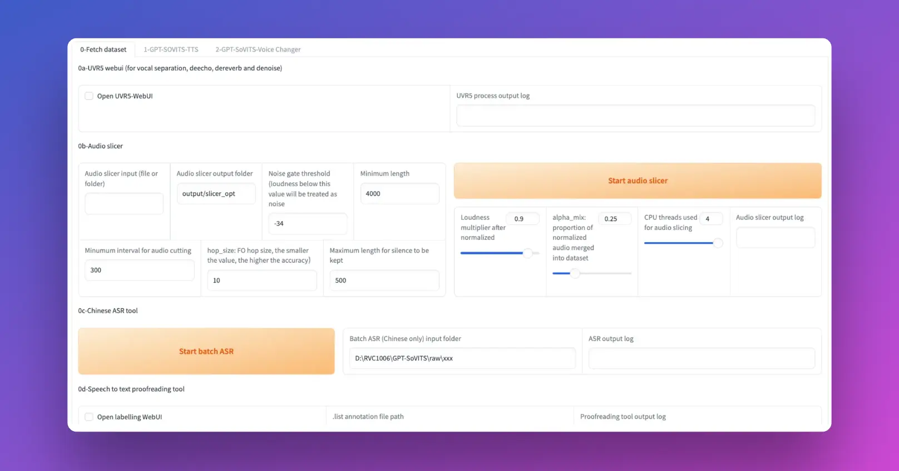

# GPT-SoVITS: AI Cloning with 1-Minute Voice Samples

`GPT-SoVITS` is an advanced model capable of voice transformation and text-to-speech timbre cloning with minimal sample input. It facilitates voice inference in Mandarin, English, and Japanese. According to developer tests, a voice sample as brief as five seconds allows for the creation of a voice clone with 80% to 95% similarity. Providing a one-minute voice sample significantly enhances the quality, closely mimicking a real human voice and enabling the development of superior text-to-speech models.



## Preliminary Steps

This guide outlines the installation of GPT-SoVITS and its application in synthesizing realistic AI voices using a one-minute voice clip on an 8GB VRAM graphics card. We utilize the following open-source repositories:

### GPT-SoVITS Voice Synthesis Tool

GPT-SoVITS: [GitHub Repository](https://github.com/RVC-Boss/GPT-SoVITS)

#### Features:

1. **Instantaneous Text-to-Speech (TTS) with Zero Samples:** Input a five-second voice sample to instantly convert text to speech.
2. **TTS with Minimal Samples:** Refine the model with only one minute of training data to enhance fidelity and realism.
3. **Multilingual Support:** Performs inference in languages not present in the training set, currently including English, Japanese, and Chinese.
4. **WebUI Toolset:** Features tools such as voice accompaniment separation, automatic training set segmentation, Chinese automatic speech recognition (ASR), and text annotation, aiding novices in dataset preparation and GPT/SoVITS model creation.

## Installation of GPT-SoVITS

### Configuring a GPU Instance

For detailed interactive guidance, visit the [LooPIN Liquidity Pool](/docs/quick-start/swap).

#### Steps:

1. **Acquire GPU Resources via LooPIN Liquidity Pool:** Visit [LooPIN Network Pool](https://loopin.network/pool) and use $LOOPIN tokens to purchase GPU time, choosing the appropriate GPU model based on individual needs and budget, such as the RTX 3080, at [GPU UserBenchmark](https://gpu.userbenchmark.com/).

2. **Exchange Tokens for GPU Resources:** Select the desired $LOOPIN token amount, adjust the GPU quantity via a slider, and finalize the transaction.

3. **Accessing Jupyter Notebook:** Post-transaction, navigate to the **Server** section under **Rented Servers** and access Jupyter Notebook via your remote server. Instance initialization typically requires 2-4 minutes.

4. **Verify GPU Activation:** In Jupyter Notebook, initiate a new terminal window, execute the `nvidia-smi` command to ensure GPU activation.

```shell
+-----------------------------------------------------------------------------------------+
| NVIDIA-SMI 550.54.15              Driver Version: 550.54.15      CUDA Version: 12.4     |
|-----------------------------------------+------------------------+----------------------+
| GPU  Name                 Persistence-M | Bus-Id          Disp.A | Volatile Uncorr. ECC |
| Fan  Temp   Perf          Pwr:Usage/Cap |           Memory-Usage | GPU-Util  Compute M. |
|                                         |                        |               MIG M. |
|=========================================+========================+======================|
|   0  NVIDIA GeForce RTX 3080        Off |   00000000:01:00.0 Off |                  N/A |
|  0%   39C    P8             21W /  350W |      12MiB /  12288MiB |      0%      Default |
|                                         |                        |                  N/A |
+-----------------------------------------+------------------------+----------------------+

+-----------------------------------------------------------------------------------------+
| Processes:                                                                              |
|  GPU   GI   CI        PID   Type   Process name                              GPU Memory |
|        ID   ID                                                               Usage      |
|=========================================================================================|
+-----------------------------------------------------------------------------------------+
   ```


#### GPT-SoVITS Framework Installation:

**Dependencies:**

- `Python` 3.10.6
- `FFMPEG` 16.0
- `CUDA` >11.8

**Installation Steps:**

After the dependency software is installed, follow these steps to manually install `GPT-SoVITS`:

1. Open Linux Terminal, switch to the directory where you want to install `GPT-SoVITS`
2. Install `Miniconda`

```shell
curl -LO https://repo.anaconda.com/miniconda/Miniconda3-latest-Linux-x86_64.sh
bash Miniconda3-latest-Linux-x86_64.sh
```

3. Copy the project clone command, execute in Terminal:

```
git clone https://github.com/RVC-Boss/GPT-SoVITS
```

4. Copy the directory switch command, execute in Terminal:

```
cd GPT-SoVITS
```

5. Copy the Linux installation command, execute in Terminal:

```
conda create -n GPTSoVits python=3.9
conda activate GPTSoVits
bash install.sh
```

During the installation, continuously allow `Proceed ([y]/n)?`, enter `y` to continue installation

At this point, the `GPT-SoVITS` program is installed, next is to manually download the model files needed:

```shell
cd /workspace/GPT-SoVITS/GPT_SoVITS/pretrained_models
git clone https://huggingface.co/lj1995/GPT-SoVITS
# If in Chinese area use this
# git clone https://hf-mirror.com/lj1995/GPT-SoVITS
mkdir damo_asr && mkdir damo_asr/models && cd /workspace/GPT-SoVITS/tools/damo_asr/models
git clone https://www.modelscope.cn/damo/speech_paraformer-large_asr_nat-zh-cn-16k-common-vocab8404-pytorch.git
git clone https://www.modelscope.cn/damo/speech_fsmn_vad_zh-cn-16k-common-pytorch.git
git clone https://www.modelscope.cn/damo/punc_ct-transformer_zh-cn-common-vocab272727-pytorch.git
cd /workspace/GPT-SoVITS/tools/uvr5 && rm -r uvr5_weights
git clone https://huggingface.co/Delik/uvr5_weights
# If in Chinese area use this
# git clone https://hf-mirror.com/Delik/uvr5_weights
git config core.sparseCheckout true
mv /workspace/GPT-SoVITS/GPT_SoVITS/pretrained_models/GPT-SoVITS/* /workspace/GPT-SoVITS/GPT_SoVITS/pretrained_models/
```

Finally, run webui:

```shell
cd /workspace/GPT-SoVITS/ && python webui.py
```

We will continue to introduce how to use `GPT-SoVITS` in subsequent tutorials.

## Conclusion

`GPT-SoVITS` stands out as a robust, user-friendly AI voice cloning tool that employs the GPT framework and reference audio prompts to address traditional voice cloning challenges. It supports multiple languages, is open-source, and offers both an integrated one-click installation package and a manual setup option, making

it accessible to beginners. Its capability to generate highly realistic voice clones with minimal training data positions it as a leader among free open-source voice cloning tools.

`Updated at May 7, 2024`