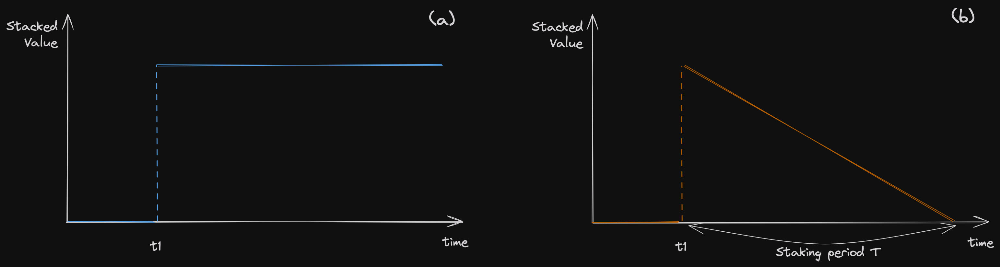

# 探秘 PinFi：深入解析

每一个传奇背后都有其故事。传奇从不空穴来风，也不会无痕地消逝，每一个真正的传奇都是力量的象征，其到来总是恰到好处——既不早也不迟，正是这种精准的时机定义了她的传奇地位。在加密货币世界，这样的例子层出不穷，从比特币到以太坊，从去中心化金融 (DeFi) 到去中心化个人网络 (DePIN)，而今有了 PinFi，我们见证了一代代传奇的诞生和崛起。

我知道你心中有无数疑问和好奇。这正是我撰写这篇博文的原因——全面解析 PinFi 的一切。从其诞生的初衷、理论基础，到在人工智能计算及资产交易中的潜在影响，这篇文章为你揭开了 PinFi 的神秘面纱。

### 深入解析 PinFi：它是什么，为什么重要？

在深入了解 PinFi 之前，我们先来看看“耗散资产”的概念。顾名思义，耗散资产指的是那些价值会随时间逐渐减少的资产。从人力到服务，从电力到 AI 计算能力，再到酒店客房，几乎你能想到的所有东西都可被视为耗散资产。没错，即使是你的住宅也不例外。如果不进行适当维护，它的价值也会随时间而降低。

目前，计算能力这一关键的耗散资产正是 DePIN 社区关注的焦点。众多团队正努力开发各自的分散式计算网络（DCN），如 Io.net、Nosana、Render Network 和 Akash Network 等。这些网络的发展潜力似乎无限，越来越多的实体正跃跃欲试，准备进入这个领域并建立自己的网络。

展示这些网络优势的一个关键指标是每个网络整合的 GPU 数量。虽然数字看起来令人印象深刻，但进一步观察却发现实际情况有所不同。仔细检查后发现，这些网络的实际利用率相当低；通常只有大约 5% 的 GPU 正在积极执行 AI 任务。其余 95% 的 GPU 大多数时间处于空闲状态，这种情况引发了关于 DCN 在实际应用中效率和实用性的重要疑问。为什么会出现这种资源利用不足的情况？

要理解 DCN 资源利用不足的原因，需要评估 DCN 相比传统数据中心有哪些优势。对于训练小型模型，比如卷积神经网络 (CNNs)、残差网络 (ResNets) 或联邦学习模型，大规模并行 GPU 使用并非必须。只要 GPU 能提供足够的 TFLOPS 和 vRAM，这些模型就能有效训练。这也适用于这些模型的微调和推理阶段，DCN 在此应能显示出其优势。

然而，在 DCN 上训练现代大型语言模型 (LLM) 则面临挑战。通常，限制这一过程的并非 GPU 的 TFLOPS，而是带宽的可用性。最先进的 GPU 训练集群依赖于专门优化的点对点闭合网络，这对于高性能模型训练至关重要。此外，为了提高网络间带宽，需要 100Gbps 的 RDMA 网络接口卡，高效的作业调度器，如 Pollux、Themis 或 Cassini 也是必不可少的。高带宽连接和先进的调度方案的缺失显著限制了 DCN 在培训复杂模型方面的有效性。

DCN 相对于传统数据中心的主要优势有两方面：一是提供可靠且不受审查的服务；二是对于小型模型的训练、微调和推理以及大型模型的微调和推理提供成本效益。任何 DCN 自然能满足第一个优势，前提是其作业调度算法足够高效。然而，第二个优势由于现有 DCN 中普遍采用的集中式定价模式——一个价格的无限流动性，导致资源的低效利用和缺乏流动性。

为了吸引更多用户使用分散式计算网络 (DCN)，计算资源的定价需要具有竞争力。同时，定价不能太低，以免阻碍 GPU 提供商加入网络。这两方面的平衡决定了这些资源的市场真实价格。为了实现这种动态定价，将分散式金融 (DeFi) 领域常用的自动市场制造机制整合到 DCN 中非常关键。这正是 PinFi 的核心角色。总的来说，PinFi 代表了分散式个人计算 (DePIN) 和分散式金融 (DeFi) 的结合。从数学角度看，PinFi 等于 DeFi 结合 DePin。

### LooPIN 是如何运作的？

下图展示了基于 PinFi 协议的第一个项目——LooPIN 网络的总体架构。此图为我们如何将分散式金融 (DeFi) 与分散式计算网络 (DCN) 结合，从而提高系统效率和资源利用率提供了一个全面的视角。

LooPIN 网络的运作依赖于几个关键组成部分，每个部分都对其创新和去中心化的架构作出了贡献：

1. **流动性池** 网络的核心是流动性池，这些池根据代表的计算能力资源类型（例如 GPU，未来可能是 TPU 或 Groq 芯片）进行区分。这些池被设计为无需许可和抗审查，任何人都可以通过我们的智能合约在区块链上设立流动性池。
2. **分散式计算网络集群（DCNE）** 由各种独立计算提供商贡献的无需许可的流动性池汇聚成所谓的分散式计算网络集群（DCNE）。这可以看作是“网络的网络”，代表了新一层的分散计算基础设施。
3. **提供者/矿工** 矿工是通过提供设备并向指定的流动性池质押代币参与 LooPIN 网络的用户。通过参与计算能力证明质押过程，矿工验证其持续贡献的计算能力，供客户使用。在预定时间点，根据其贡献及协议的治理，矿工将获得区块奖励。
4. **客户/用户** 客户通过使用特定流动性池中的计算资源与 LooPIN 网络互动。与矿工相似，客户在指定时间也有资格获得区块奖励，以表彰他们对网络计算需求的参与和贡献。
5. **验证者** 验证者在维护 LooPIN 网络完整性中扮演着关键角色，他们利用计算能力证明质押方案，高效地确认设备不仅声称提供，而且实际上确实提供了客户安全可靠的服务。

图 1：该图展示了 PinFi 如何将 DCNs 和 DeFi 融合，以优化 DCNs 中的资源利用和定价。

为了理解 LooPIN 系统如何提升分散式计算网络 (DCN) 的流动性，可以考虑一位资源持有者拥有计算资源的场景。在传统的 DCN 中，这位卖家无法立即出售他的计算资源；他必须在网络上列出他的资源并等待有人租用他的 GPU。在这种租赁发生之前，他无法实现资源的货币化。与此形成对比的是，LooPIN 系统允许他立即实现货币化。通过将他的资源注入相应的流动性池，他不仅实现了货币化，还能获得奖励。

图 2 详细展示了 LooPIN 的操作方式。图中描述了一个拥有 NVIDIA RTX 4090 GPU 的矿工如何将这一资产在 LooPIN 分散式计算网络集群 (DCNE) 中质押两小时。质押过程包括以下步骤：

1. **代币销毁和证书发行**: 矿工销毁指定数量的代币以获取一个燃烧代币证书，标志着他们对网络的初步承诺。
2. **证书存款和代币分配**: 通过将此证书连同维护费（对选择作为流动性提供者的矿工免收）存入智能合约地址，矿工获得两种代币：st-4090-token，一种不可交易、不可转让的代币，作为提供流动性的凭证，有效期为两小时；及 4090-token，其存在依赖于 st-4090-token 的生命周期。
3. **流动性注入**: 通过投入 4090-token 和等值的实用代币来增强 4090 池的流动性。在 st-4090-token 到期时，将发生两个重要事件：矿工因其计算资源的质押获得奖励，实用代币将按当前汇率自动返还给矿工。
4. **流动性移除**: 矿工可以选择将他们的 4090-token 卖给池换取实用代币，同时支付一定的交换费。在 st-4090-token 到期并经过成功的交互验证后，将退还维护费。

图 2：LooPIN 方案的示意图。

### PinFi 与 DeFi 的区别：深入理解差异

在传统的分散式金融 (DeFi) 环境中，由代币对 A 和 B 组成的流动性池表现出静态特性，在没有外部互动的情况下，除非受到交易或其他形式的干预，否则这些代币的数量保持不变，时间 t 保持常数。这种代币对的不变性是传统 DeFi 流动性池的特征，其中活动的缺乏不改变资产的平衡。在 DeFi 场景中，流动性注入可如图 3(a) 所示进行说明。

相对而言，PinFi 协议引入了一种创新的流动性池方法，与传统模式区别开来。在 PinFi 的框架中，流动性池中的一种代币代表总计的抵押计算能力小时数——一种动态和耗散的资产，其价值本质上随时间 t 逐渐减少，反映了计算资源的消耗特性。池中的另一个代币是协议代币，作为这对中的稳定对手。考虑一个 PinFi 系统中的简化流动性注入事件，如图 3(b) 所示。

图 3：分散式金融 (DeFi) 系统的原理 (a) 与物理基础设施金融 (PinFi) 系统的固有耗散动态 (b) 形成鲜明对比。

这种差异使得在智能合约中实施 PinFi 协议变得复杂。为确保协议的稳定性和可持续性，进行严格的研究至关重要。协议效果和市场效率的关键要素是流动性提供者 (LPs) 的角色。解决若干挑战对于稳定协议至关重要：LPs 可能更愿意在外部市场而不是在 PinFi 系统内销售；他们可能选择出售他们的资产而不是作为 LPs 贡献；并且存在 LPs 不愿在协议内参与的风险。

我们的研究显示，在假定参与者诚实且在常见条件下，PinFi 协议能在 LPs、卖家和买家之间保持动态平衡。向 LPs 提供的奖励需要精心平衡：如果奖励过低，LPs 会选择将他们的计算资源出售以换取非耗散代币而不是作为 LPs；如果奖励过高，则会导致卖家稀缺，破坏市场平衡。LPs、买家和卖家之间的复杂动态进一步在图 4 中详细展示，并在我们最近的博弈论论文中进行了深入阐述（见 [https://arxiv.org/pdf/2404.02174.pdf])。

图 4：展示耗散资产定价中动态和平衡的相图。

### PinFi & LooPIN 的未来发展

通过两篇学术文章和beta测试网，PinFi 的概念阶段已经实现。即使在我们的测试中，协议的核心组成部分也已经上链，确保了整个生态系统的公平性。我们计划逐步将所有链下元素过渡到链上等价物。不久的将来，我们还将提供包括那些聚焦于 LooPIN 网络调度机制开发的技术论文。

