# 如何在 Solana 和 Ethereum 之间转移你的代币

## 了解 Solana 和 Ethereum 上的代币

我们在 Ethereum 和 Solana 上的代币都是标准原生代币。在 Ethereum 上，我们基于 [OpenZeppelin ERC20.sol 合约](https://github.com/OpenZeppelin/openzeppelin-contracts/blob/master/contracts/token/ERC20/ERC20.sol) 构建我们的 ERC20 代币。在 Solana 上，我们使用 [经过同行评审的标准 Solana-program-library 代币合约](https://github.com/solana-labs/solana-program-library/tree/master/token/program)。作为两个区块链上的标准原生代币，它们与去中心化金融 (DeFi) 协议中的所有代币生态系统兼容，确保安全性和互操作性。

我们计划将 Solana 测试网上的代币迁移到主网，同时保持相同的代币经济结构。每日代币铸造将在 Solana 上继续进行，分发由财政账户处理。代币持有者可以使用我们的官方跨链桥在 Solana 和 Ethereum 之间自由转移他们的代币，该跨链桥由 [Wormhole 团队](https://wormhole.com/) 提供技术支持。

## 了解跨链桥

我们使用原生代币转移 (Native Token Transfers, NTT) 协议进行跨链应用。NTT 是一个开放框架，可以在不同区块链之间无缝创建和转移代币，同时保持所有权和合约可升级性。由 Wormhole 团队开发的 NTT 现在在 Solana 和以太坊虚拟机 (EVM) 兼容链的跨链应用中被广泛采用，包括 Lido、Jito 和 EtherFi 等项目。

想了解更多关于 NTT 的信息，请访问 [官方 NTT 页面](https://wormhole.com/products/native-token-transfers) 或参考他们的 [常见问题解答](https://wormhole.com/docs/build/contract-integrations/native-token-transfers/faqs/)。

## 步骤指南：将你的代币从 Solana 转移到 Ethereum

### 准备工作：
1. 一个 Solana 钱包（作为源钱包）
2. 一个 Ethereum 钱包（作为目标钱包）
3. 各自钱包中有足够的 SOL 和 ETH 用于支付交易手续费

注意：本指南以 Phantom 钱包用于 Solana 和 MetaMask 用于 Ethereum 为例。

### 步骤：

1. 访问 https://loopin.network/bridge

2. 连接源钱包 (Solana)：
- 点击"连接源钱包"
- 选择 Phantom 钱包
- 如果有提示，确认连接

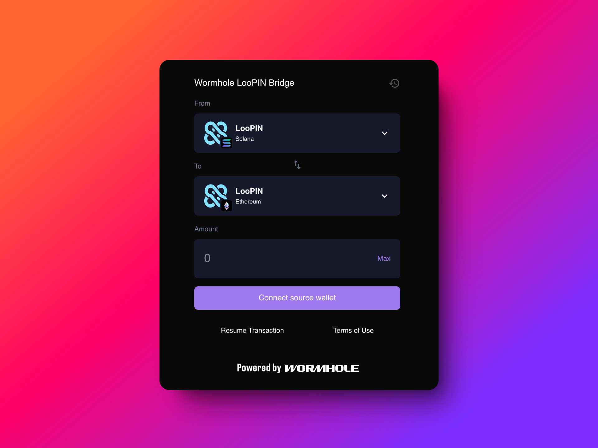

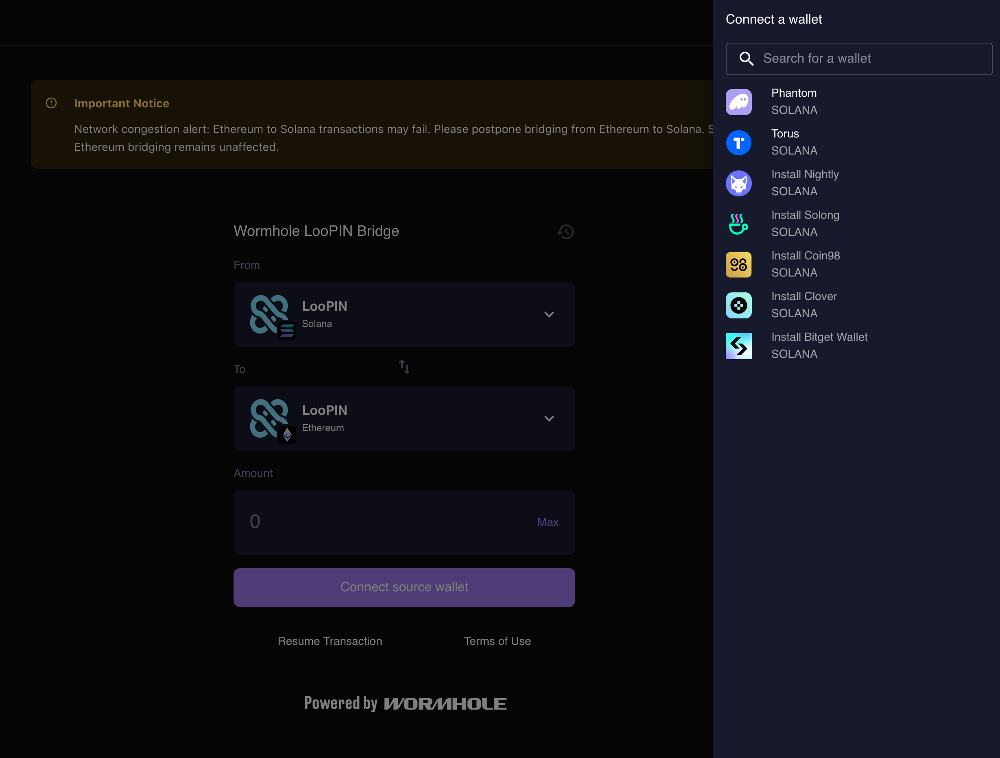

3. 连接目标钱包 (Ethereum)：
- 点击"连接目标钱包"
- 选择 MetaMask

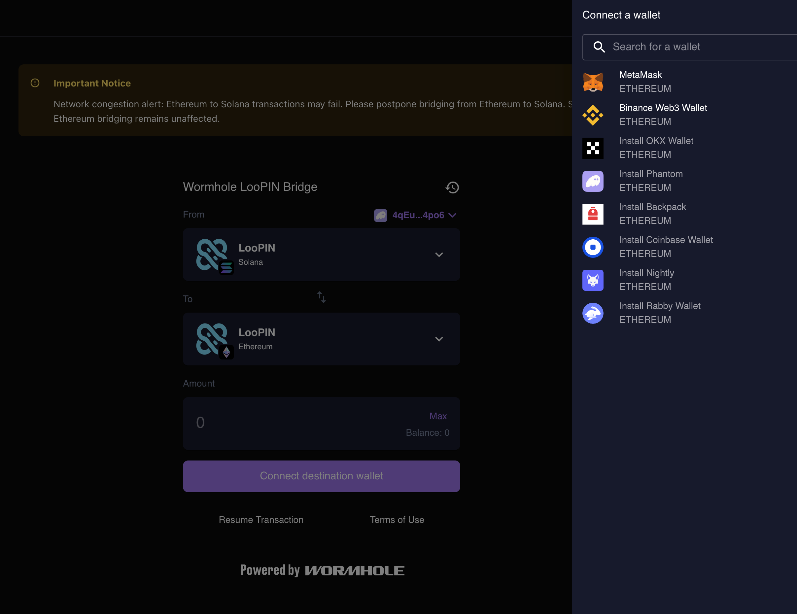

4. 验证钱包地址：
- 确保两个钱包地址都正确显示

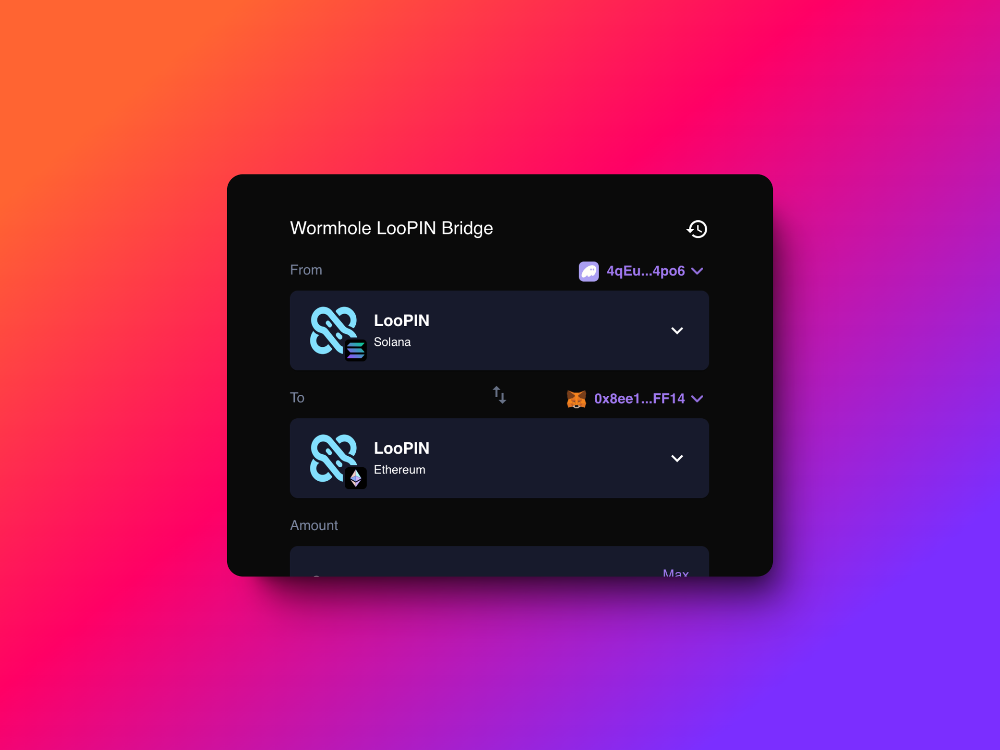

5. 发起代币转移：
- 输入要转移的 LooPIN 数量
- 等待路由加载
- 点击"审核交易"

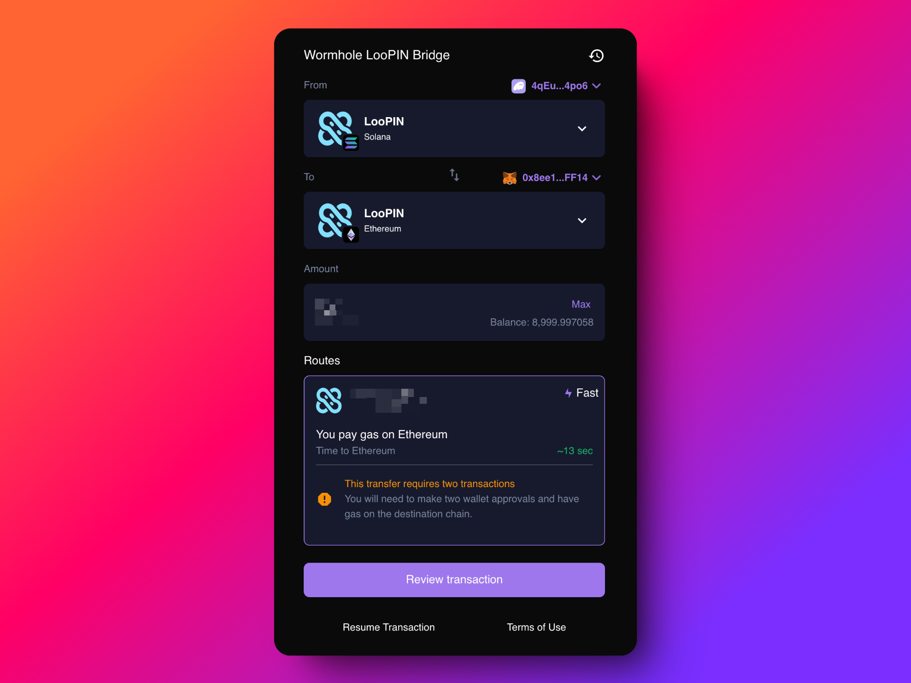

6. 确认交易：
- 查看预估时间
- 点击确认交易

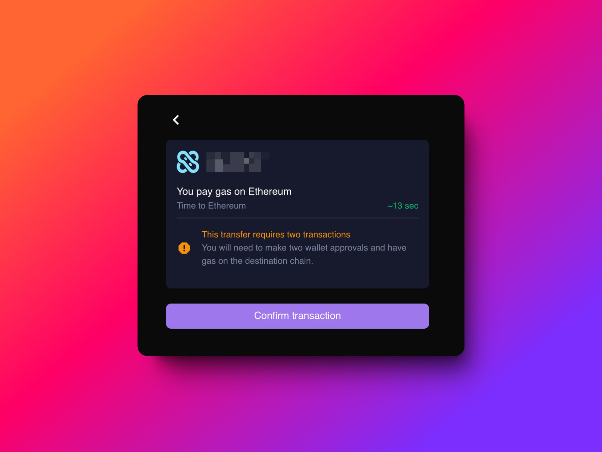

7. 签署交易：
- 等待 Phantom 钱包签名请求
- 签署交易

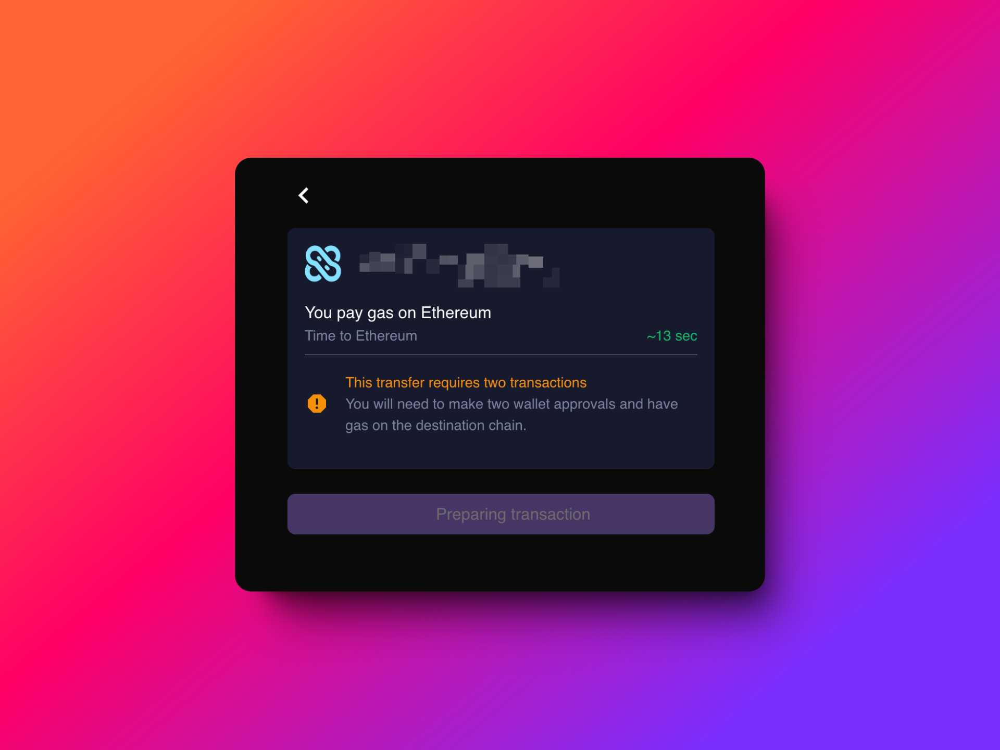

8. 等待处理：
- 交易通常需要 10-20 秒 (Solana 到 ETH)
- 注意：ETH 到 Solana 可能需要长达 20 分钟。关闭此页面以防止系统过载。然后使用"恢复交易"功能继续您的领取操作。

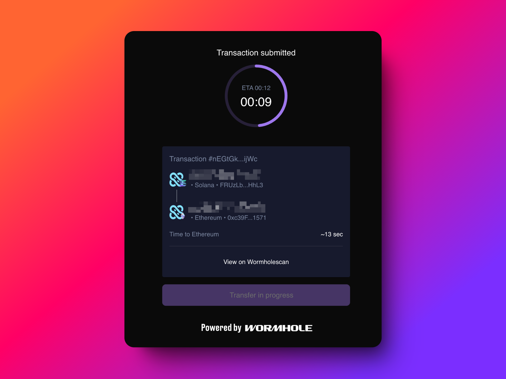

9. 在 Ethereum 上领取代币：
- 准备就绪时，点击领取代币
- 在 MetaMask 中签署确认

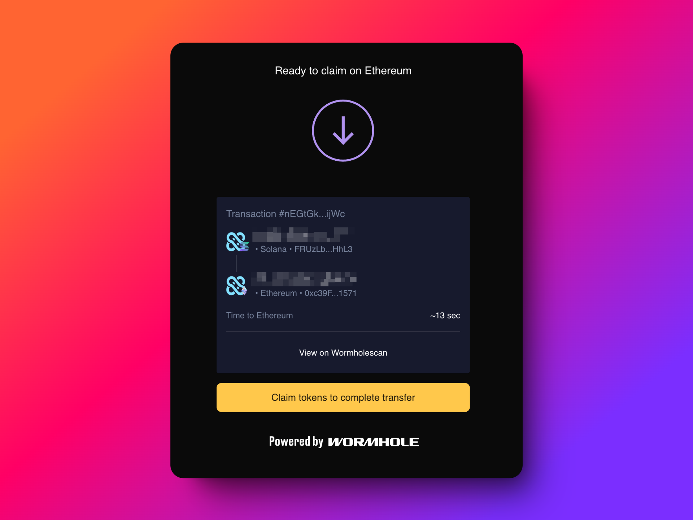

10. 验证完成：
- 检查您的 Ethereum 钱包中是否有转移过来的 LooPIN 代币 (ERC20)

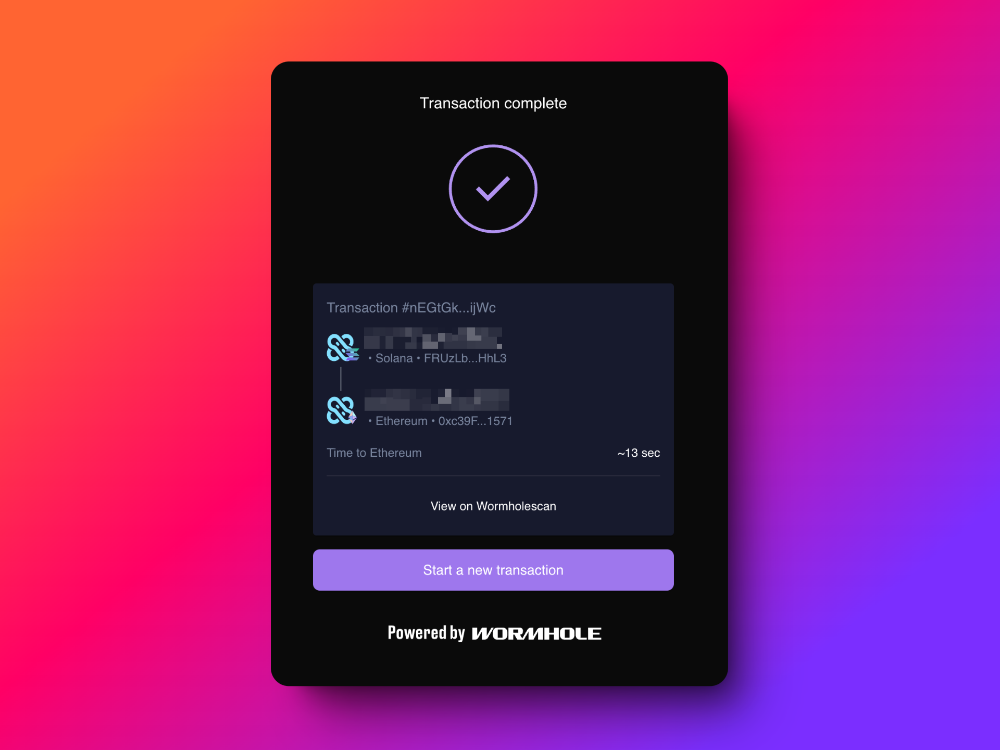

如果遇到任何问题，您可以在 Wormholescan 上查看交易，并联系我们的团队或 Wormhole 团队寻求帮助。

通过遵循这些步骤，您可以成功地将 LooPIN 代币从 Solana 转移到 Ethereum。请始终确保您使用的是官方平台，并在过程中注意交易手续费。

## 如何恢复从以太坊到 Solana 的跨链交易

当从以太坊 (Ethereum, ETH) 发起到 Solana 的跨链交易时，整个过程可能需要长达 20 分钟。本指南将向您介绍如何在等待期间需要关闭页面时恢复未完成的交易。

### 步骤 1：发起交易

1. 按照常规步骤开始您的以太坊到 Solana 的转账交易。
2. 当您看到倒计时页面时，可以安全地关闭它。

### 步骤 2：找到您的最近交易

1. 当您准备恢复交易时 (最好接近 20 分钟左右)，在界面右上角寻找"最近交易"图标。
2. 点击此图标查看您的最近交易记录。

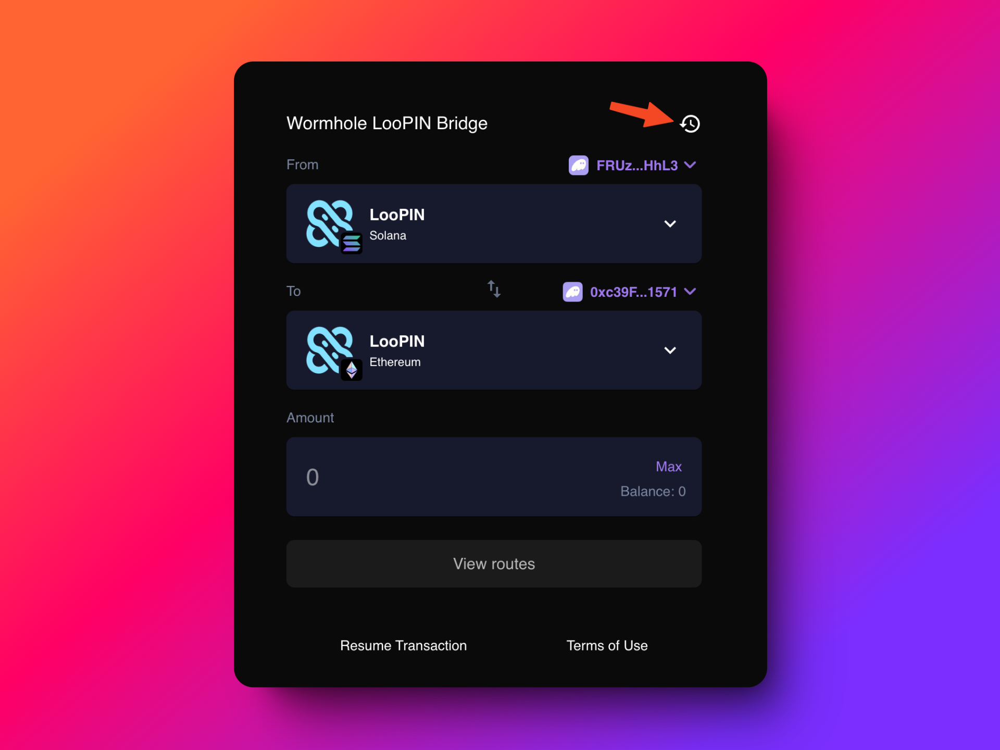

3. 找到并点击您最近进行的交易。
4. 这将显示 Wormhole 交易 ID (txid)。

### 步骤 3：恢复交易

1. 进入平台的"恢复交易"页面。
2. 输入您的 Wormhole 交易 ID 以获取未完成的交易信息。
3. 使用源链 (在这种情况下是以太坊) 以及交易哈希 (一串唯一标识交易的字符代码) 来恢复交易过程。

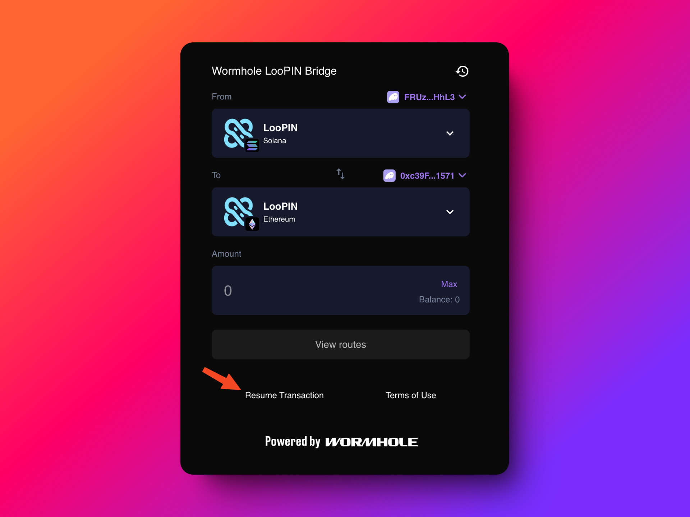

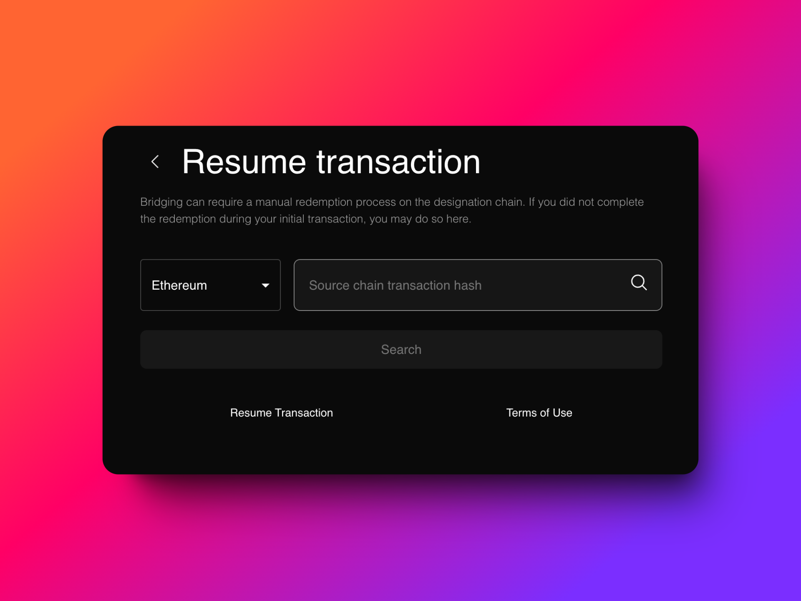

### 重要注意事项：

1. **网络延迟**：从以太坊到 Solana 的跨链转账可能会遇到较长的网络延迟。交易期间请保持耐心。

2. **避免系统负担**：在 20 分钟的等待期间，建议关闭交易页面以减轻系统负担。

3. **Solana 确认过程**：在 Solana 上确认交易时，您可能需要进行 3-5 次单独的签名操作。每次签名可能需要 15-30 秒来处理。

通过遵循这些步骤，您可以轻松恢复从以太坊到 Solana 的跨链交易，确保即使在过程中需要暂时离开，您的资产也能顺利转移。
