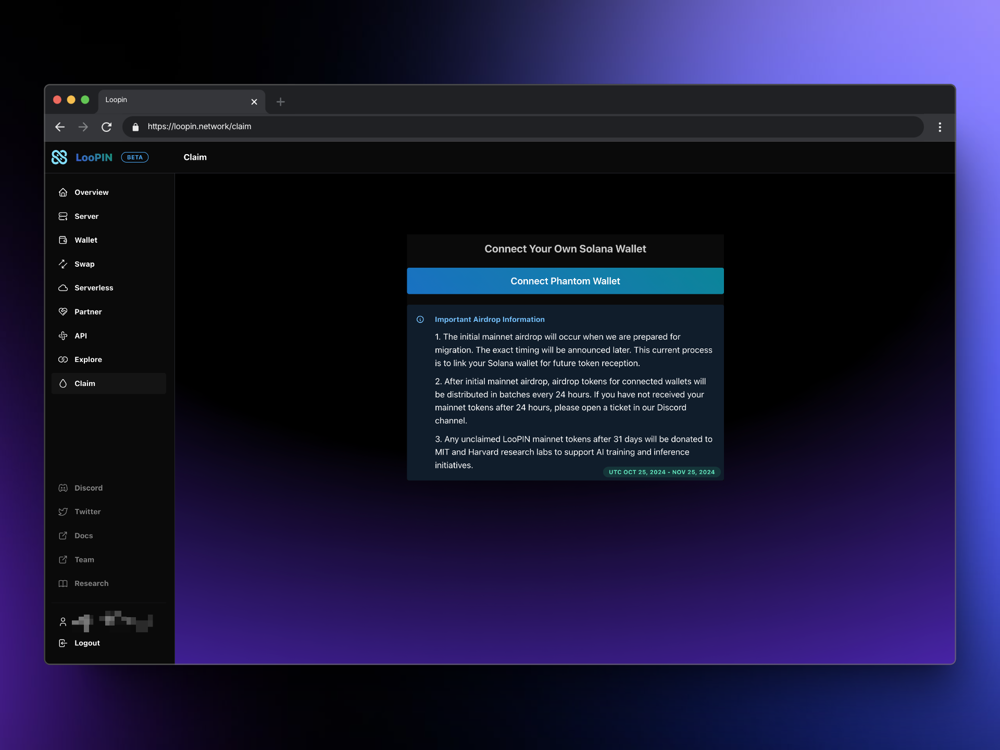
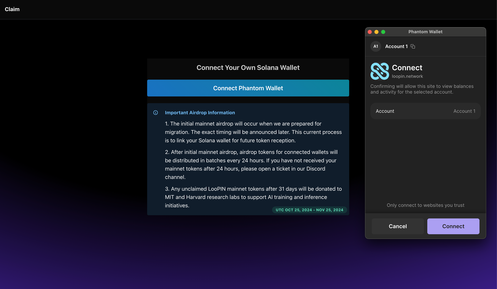
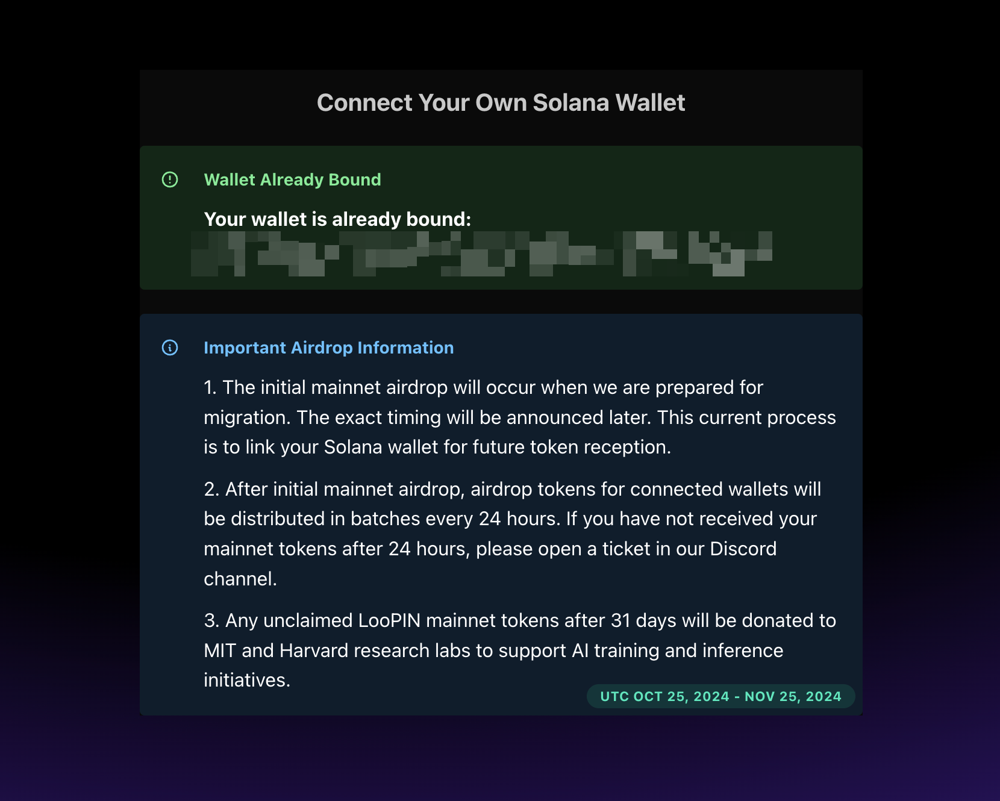

# 如何将 Solana 钱包与您的 LooPIN 网络账号关联

随着 LooPIN 主网（mainnet）即将启动，所有现有 LooPIN 用户都需要通过 Phantom 钱包绑定他们的 Solana 钱包，以获得首次主网空投（airdrop）的资格。空投日期将很快公布。为确保您能在第一批中收到主网代币，请尽快绑定您的 Solana 钱包。在首次主网空投后绑定的钱包将在 24 小时的区块批次中收到代币。

## 准备工作

1. 一个有效的 LooPIN 账号（可在 https://loopin.network 注册）
2. 安装 Phantom 钱包（https://phantom.app/ ）
- 您可以从 https://phantom.app/download 下载 Phantom 钱包的 Chrome 或 Firefox 浏览器扩展
- 按照官方指南创建新钱包或导入现有钱包：https://phantom.app/learn/guides/how-to-create-a-new-wallet

## 将 Solana 钱包与 LooPIN 账号绑定的步骤

1. 登录您的 LooPIN 账号，并前往 https://loopin.network/claim 的领取页面

2. 点击页面中央的"连接 Phantom 钱包"按钮。您的 Phantom 钱包会弹出确认窗口，询问是否连接到 LooPIN 网络。

3. 在 Phantom 钱包中，点击"连接"以授权 LooPIN 访问您的 Solana 钱包地址。

4. 如果连接成功，您将看到成功提示，并且页面上会显示您的钱包地址。

5. 刷新页面，确认您的账号已成功与 Solana 钱包绑定。

## 常见问题解答

1. **我可以断开当前 Solana 钱包的连接，然后在主网领取页面重新连接另一个钱包吗？**
不可以，您只能进行一次连接。连接后，您无法更改用于主网空投的绑定钱包。如果因特殊原因需要更换空投钱包，请在 Discord 上提交工单，联系团队寻求帮助。

2. **我可以将多个钱包绑定到一个 LooPIN 账号吗？**
不可以，每个 LooPIN 账号只能绑定一个钱包。当我们宣布主网启动时，所有测试网代币将被转换为主网代币，并发送到您绑定的钱包。

3. **我可以将一个钱包地址关联到多个 Loopin 账号吗？**
可以。这些钱包仅用于在主网启动时接收代币。如果您将多个 Loopin 账号关联到同一个钱包，在主网切换期间您将看到多笔交易。

4. **如果我在首次主网空投之前没有连接钱包怎么办？**
不用担心，即使错过了首次主网空投，您仍有 31 天的时间来连接钱包并接收主网代币。在此期间连接钱包后，您可能需要等待最多 24 小时才能收到代币。如果 24 小时后仍未收到，请在 Discord 上联系团队寻求帮助。若超过 31 天期限，您的代币将作为感谢礼物发送给麻省理工学院（MIT）和哈佛大学（Harvard）的研究实验室，用于人工智能（AI）训练和推理目的。

5. **在哪里可以找到关于 Phantom 钱包的更多信息？**
您可以在 https://phantom.app/learn/guides 和 https://phantom.app/learn/crypto-101 找到有用信息。如有钱包相关的具体问题，可以在 https://help.phantom.app/hc/en-us 联系 Phantom 官方团队寻求帮助。

请记住，绑定 Solana 钱包是接收主网代币的关键步骤。如果在操作过程中遇到任何问题，请随时在 Discord 上联系 LooPIN 团队寻求支持。
