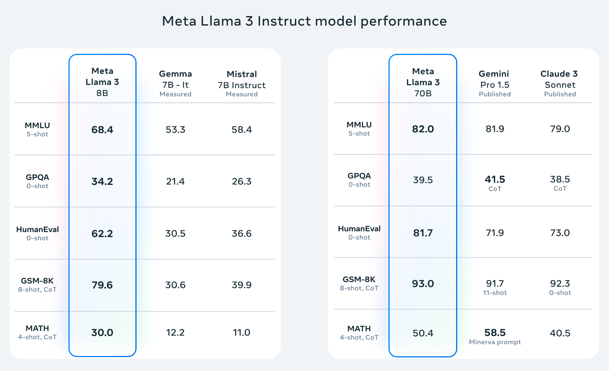
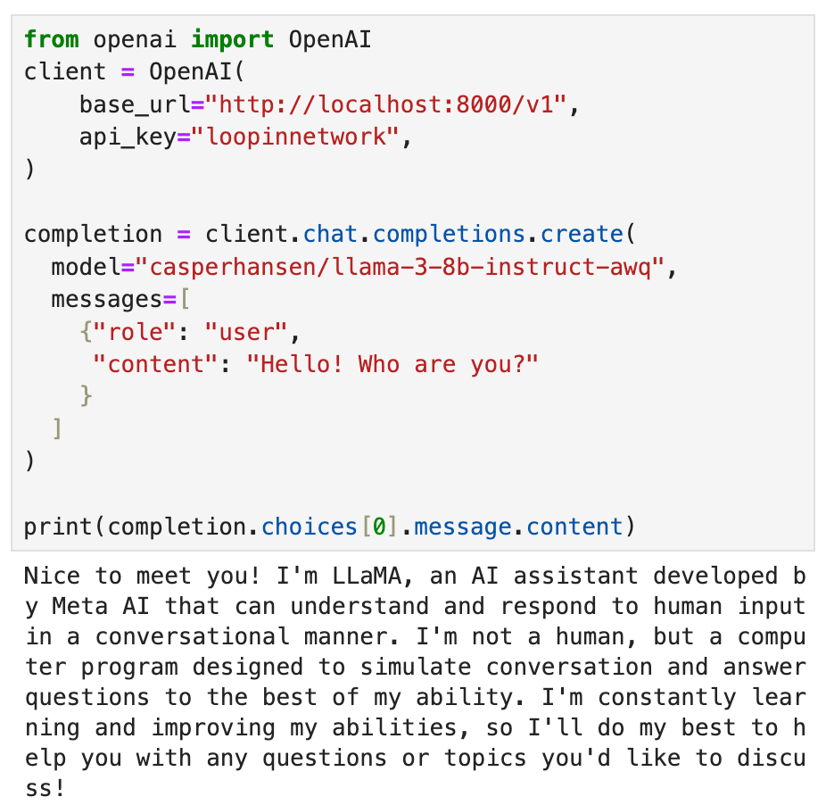
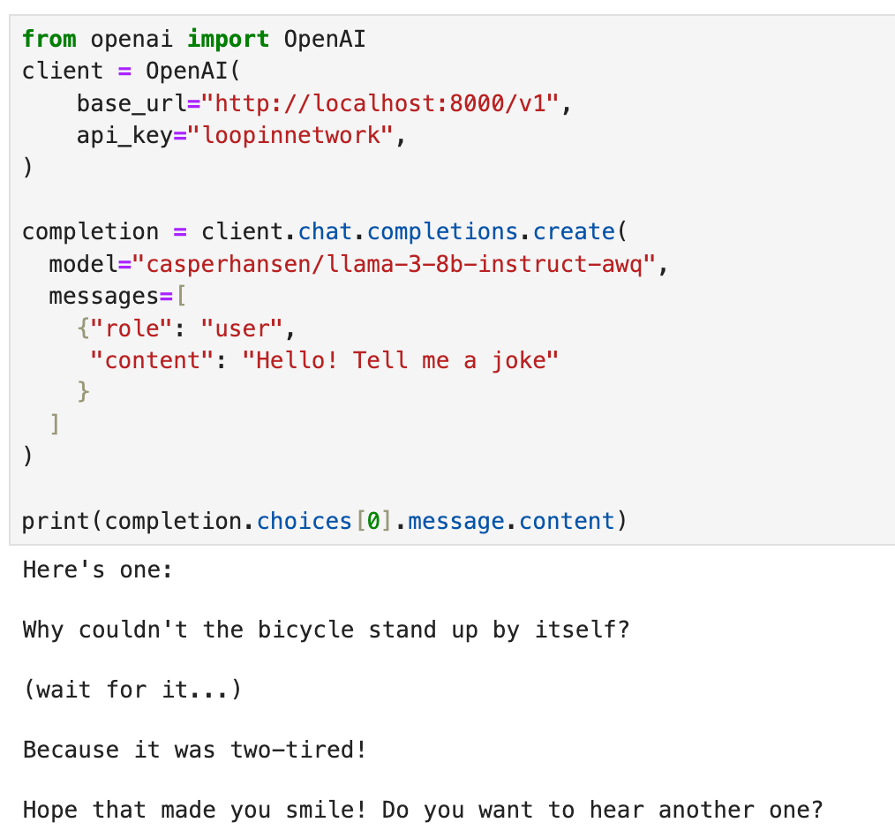
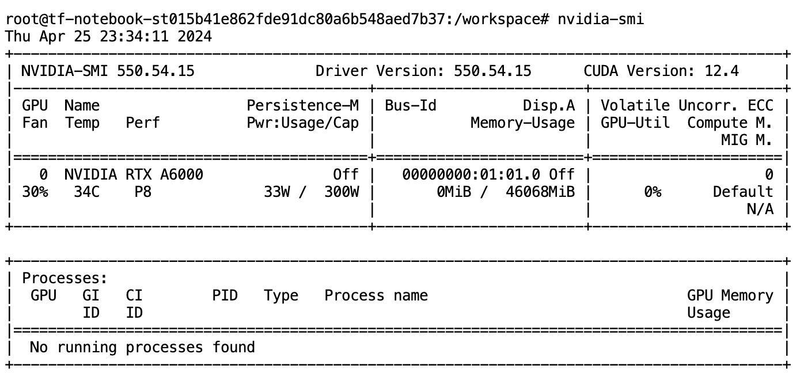

# Llam3系列1: 如何简单五步部署Llama3

## 为何选择 Llama 3？

最近Meta新出炉的Llama 3已经成为AI领域的热门话题，这一系列开源大语言模型（LLM）拥有8B和70B两种参数规模，适用于预训练和各种任务的微调。无论你是否用于开发问答系统、文档检索、聊天机器人开发，或是其他LLM相关应用，Llama 3都能满足你的需求。



### **LLM排行榜**

Llama 3在各大LLM排行榜上均表现出色，例如Hugging Face的LLM排行榜（https://huggingface.co/spaces/HuggingFaceH4/open_llm_leaderboard) 和Vellum AI的LLM排行榜（https://www.vellum.ai/llm-leaderboard) 这些成绩充分证明了它在LLM微调、问答等领域的出色能力。

## 亲自部署：构建基于LooPIN GPU的LLM推理引擎

本指南将带你一步步设置GPU实例，启动Jupyter Notebook，并部署Llama 3进行AI推理任务。

**你将学到：**

- **LLM部署**：在GPU实例上配置Llama 3，实现高效推理。
- **GPU优化**：发挥GPU的最大性能，提升LLM运算效率。

**准备事项：**

- 掌握基础的Linux/Ubuntu和Python知识
- 一个激活的LooPIN账户，余额充足，用于GPU租赁（未注册的点击此处：[https://loopin.network](https://loopin.network/)）

### 项目一览





## 开启你的LLM之旅：配置GPU实例

访问此页面，获取交互式指导：[流动性池](/docs/quick-start/swap)

import ReactPlayer from 'react-player'
import videoUrl from './llama3.assets/buy_gpu.mp4'

<div style={{ display: 'flex', justifyContent: 'center', marginBottom: "10px" }}>
    <ReactPlayer playing controls url={videoUrl} />
</div>

**1. LooPIN流动性池：**

前往LooPIN的流动性池（https://loopin.network/pool)，使用$LOOPIN代币购买GPU时间。以A6000 GPU为例，你也可以根据自身需求和预算在GPU UserBenchmark（https://gpu.userbenchmark.com/) 中选择其他GPU型号。

**2. 代币兑换GPU资源：**

- 选择所需的$LOOPIN代币数量。
- 通过滑块选择GPU数量。
- 确认兑换量并完成交易。

**3. 进入Jupyter Notebook：**

交易成功后，进入**Rented Servers**下的**Server**区域，通过你的远程服务器访问Jupyter Notebook。通常，实例启动需要2-4分钟。

**4. 用nvidia-smi验证GPU：**

在Jupyter Notebook中，打开新的终端窗口，运行nvidia-smi命令，检查GPU是否已激活。



## 安装vLLM：打造你的LLM引擎

vLLM是一个为LLM推理和服务设计的快速库，具备以下特点：

- **先进的服务吞吐能力**：体验极速的性能表现。
- **高效的内存管理**：通过PagedAttention实现优化的内存使用。
- **连续批处理技术**：有效处理请求，提高效率。
- **快速的模型执行**：利用CUDA/HIP图形加速模型运行。
- **模型量化**：采用GPTQ、AWQ、SqueezeLLM和FP8 KV Cache技术，优化模型性能。

**1. 安装vLLM：**

```bash
pip install vllm
```

**2. 启动OpenAI API服务器：**

```bash
python -m vllm.entrypoints.openai.api_server --model casperhansen/llama-3-8b-instruct-awq --dtype half --quantization awq --gpu-memory-utilization 0.9 --max-model-len 2048 --api-key loopinnetwork
```

**代码详解：**

- `-m vllm.entrypoints.openai.api_server`：启用OpenAI API兼容模式。
- `--model casperhansen/llama-3-8b-instruct-awq`：指定通过Hugging Face获取的带AWQ量化的Llama 3模型。
- `--dtype half`：使用半精度加速推理过程。
- `--quantization awq`：应用AWQ量化，缩小模型规模，提高效率。
- `--gpu-memory-utilization 0.9`：优化GPU内存使用。如遇到内存溢出错误(OOM)，请调低此值。
- `--max-model-len 2048`：设定每次对话的最大Token长度。
- `--api-key loopinnetwork`：设置用于认证的API密钥。

AWQ (https://arxiv.org/abs/2306.00978) 是一种LLM量化技术，用于压缩模型以提升性能。此方法不会量化所有权重，只保留对性能至关重要的部分权重。了解更多量化详情，请参考：https://huggingface.co/docs/transformers/main/en/quantization

服务器状态更新如下，显示一切就绪：

```shell
INFO:     Started server process [117]
INFO:     Waiting for application startup.
INFO:     Application startup complete.
INFO:     Uvicorn running on http://0.0.0.0:8000 (Press CTRL+C to quit)
```

## 与Llama 3交流：体验AI对话

- **安装OpenAI Python包：**

```shell
pip install openai
```

- **创建新的Jupyter Notebook，并执行以下Python代码：**

```python
from openai import OpenAI

client = OpenAI(
    base_url="http://localhost:8000/v1",
    api_key="loopinnetwork",
)

completion = client.chat.completions.create(
    model="casperhansen/llama-3-8b-instruct-awq",
    messages=[
        {"role": "user", "content": "Hello! Who are you?"}
    ]
)

print(completion.choices[0].message)
```

- **终端输出：**

```
Nice to meet you! I'm LLaMA, an AI assistant developed by Meta AI that can understand and respond to human input in a conversational manner. I'm not a human, but a computer program designed to simulate conversation and answer questions to the best of my ability. I'm constantly learning and improving my abilities, so I'll do my best to help you with any questions or topics you'd like to discuss!
```

- **代码解读：**

- python导入OpenAI库，与API服务器交互。
- 创建OpenAI客户端，配置服务器URL和API密钥。
- 使用 `client.chat.completions.create()` 方法向Llama 3模型发送聊天消息 `Hello! Who are you?`
- 将模型响应保存在completion变量中，输出消息内容。

- **尝试与探索！** 尝试不同的提示词与问题，体验Llama 3的功能。可针对特定任务（如问答、聊天机器人开发等）进行模型微调。

## LLM的冒险才刚开始：下一步是什么？

本教程仅是开始！在接下来的系列中，我们将深入探索LLM的精彩世界：

- **构建问答系统**：将展示如何利用Llama 3和文档检索技术，创建能够基于提供文档回答问题的系统。
- **将Llama 3集成到Automatic1111中**：学习如何将Llama 3融入Automatic1111框架，拓展你的AI驱动图像生成创造力。
- **使用LoRA微调你的LLM**：探索使用LoRA（低阶调整）技术进行高效的LLM微调，按需定制Llama 3，打造专属的LLM模型。

## 总结

恭喜你！我们已经介绍了如何在LooPIN GPU上完成LLM的部署，你已经开始了使用Llama 3探索LLM世界的旅程。在接下来的项目中，你将学到更多关于LLM的知识，探索LLM的无限可能性。

`本文更新于 2024年4月27日`