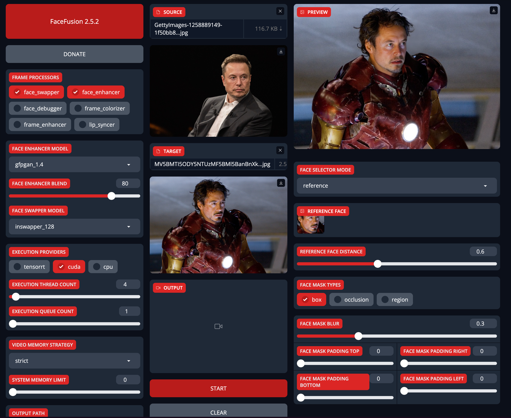

# FaceFusion系列2: AI换脸使用说明

FaceFusion，全新一代AI换脸工具，无需安装，一键运行，可以完成去遮挡，高清化，卡通脸一键替换，并且Nvidia/AMD等显卡全平台支持。FaceFusion 新版新增了很多模型和高清算法，大大提高了图片和视频的换脸效果，同时还增加了三种遮罩功能，解决了脸部有污涤遮挡时融合效果差和跳闪的问题。本文将简要阐述如何使用`Facefusion`软件调整不同参数完成一键换脸，并附上最常用的换脸设置、遮罩功能的用法，以及替换高分辨率和卡通人脸的方法。

## 准备工作

本教程将指导你如何使用Facefusion来完成换脸参数设置

我们将使用以下开源代码库：

### Facefusion AI换脸工具

Facefusion: Github地址 - [Facefusion GitHub](https://github.com/facefusion/facefusion)

FaceFusion，全新一代AI换脸工具，无需安装，一键运行，可以完成去遮挡，高清化，卡通脸一键替换，并且Nvidia/AMD等显卡全平台支持

## 安装教程

`Facefusion`的安装教程详情请查阅上一篇 [教程](facefusion)，本文基于`Gradio`界面，将具体描述不同参数的使用

## AI换脸教程

### 单张脸替换流程

介绍几个常用设置:

- FaceSwap: 换脸模式，默认勾选，否则无法换脸。
- FaceDebug: 开启遮罩时调试用的，正常换脸不需要勾选。
- Face_enhancer: 脸部增强，比较常用，开启后可让换脸后的视频更清晰。可以使用默认的`GFPGAN1.4`
- Frame_enhancer: 画质增强，非RTX4090显卡不建议勾选，会严重拖慢换脸速度。
- Face Swapper Model: 换脸模型，默认的`InSwapper_128`几乎适用各种场景，效果很好。
- Execution Provider: 换脸加速，AMD显卡和集成显卡选CPU，英伟达显卡选CUDA。
- Execusion Thread Count: 最大线程数，有8G显存可以调高一点，否则默认。
- Execusion Queue Count: 最大队列数，用脚本批量换脸时才设置，网页操作不用。
- Output path: 临时图片路径，换脸过程中存放临时图片的位置，换完程序会自动清除。
- Options - Skip-download: 跳过下载，所有模型已下载到本地，建议勾选。
- Options - Keep-temp: 保存临时图片，勾选后临时图片会保存，很占硬盘空间，不建议勾选。
- Options - Skip-audio: 输出视频不含音频，勾选后换脸视频没声音，不建议勾选。

选择一张清晰正面的人脸照片，再选择要替换的图片，右侧是预览区。

点击Start按钮替换，替换好后点击Download保存到电脑。

如果想要更清晰的效果，可以勾选脸部增强`Face_enhancer`，再替换一次。

### 视频换脸及相关参数设置

选择要替换的视频，点击识别出的人脸，预览区可看到效果。再加上脸部增强、换脸模型和脸部高清化，建议用默认组合`InSwapper128`+`GFPGAN1.4`。

`Execusion Thread Count`线程数量可以看当前显存使用情况适当调大。底部把保持原视频帧率和跳过下载勾选上。人脸很清晰没有遮挡物的视频，右侧参数可以全部用默认值。如果生成速度较慢，可以将`Execusion Thread Count`调成12。

人脸选择模式默认从左向右检测人脸，并替换检测到的第一个。检测到的人脸会在右侧列出，点击对应人脸图标可以改变替换的人。选择`many`会替换所有检测到的人脸，选择`one`只替换检测到的第一张人脸。

`REFERENCE FACE DISTANCE`面部距离参数大部分情况下用默认值0.6即可。如果视频里有一些角度较大的低头侧脸镜头，检测出的人脸匹配度很低，可以把它调大，最大值1.5只要判断是人脸就会替换。

演示视频如下

import ReactPlayer from 'react-player'
import videoUrl from './facefusion-usage.assets/elon-tiktok-dance.mp4'

    <ReactPlayer controls url={videoUrl} />

### 遮罩功能的使用

对于脸部有物体遮挡的视频，需要选择恰当的遮罩模式，才能达到更好的面部融合效果。使用遮罩时建议开启FaceDebug调试模式，先查看设置效果。

默认的Box模式遮罩是一个绿色方框。对于化妆等脸部有遮挡的视频，要勾选第二种`occlusion`封闭遮罩模式。`Face Mask Blur`遮罩模糊默认是0.3，它调节遮挡物体的透明度，不透明物体可以调到0.5以上。移动预览进度条可以看到遮罩曲线能贴近并绕过脸部遮挡物。

调试好后执行替换前一定要先关闭FaceDebug，否则换完的视频上会有遮罩曲线。`occlusion`模式下Mask Blur值的设置可能需要多次尝试，对于透明物体如眼镜玻璃杯，调小这个值反而有更真实的融合效果。

另一个遮罩类型是`region`脸部区域模式。勾选后下面会出现眉毛、鼻子、眼睛、嘴巴等部位参数，默认全部勾选替换。如果不想替换某个部位如嘴巴，取消Mouth的勾选，预览里嘴巴区域就会标记出来不替换。这种模式对嘴部说话镜头较多的视频效果会更好一些。

当选中`occlusion`或`region`遮罩类型时，可以用`FACE MASK PADDING TOP`、`FACE MASK PADDING RIGHT`、`FACE MASK PADDING BOTTOM`、`FACE MASK PADDING LEFT`这四个参数更灵活地控制脸部替换的区域，数值越大不替换的区域就越多，控制的起始位置分别是从脸的上下左右开始。如果只选Box模式，这四个值控制的就是方形遮罩。

对于换脸时有字幕被`box`遮罩覆盖变模糊的视频，可以调整`FACE MASK PADDING BOTTOM`消除。先勾选`FaceDebug`显示出Box遮罩，调整`FACE MASK PADDING BOTTOM`直到红框没有覆盖字幕为止，然后取消`FaceDebug`执行替换。

### 高清视频和卡通人脸的替换

对于高清视频特别是有脸部特写镜头的，`Face Detector Size`人脸分析分辨率这个设置很常用，最大可设置成1024分辨率。勾选脸部增强，有脸部特写时推荐用`codeformer`算法替代`GFPGAN1.4`，皮肤纹理会更真实一些。

替换卡通人脸时，模型要选择`simswap_256`替代`InSwapper_128`，再勾选`face_enhancer`脸部增强，替换的是眼睛、鼻子和嘴巴，其他部位不变。

## 总结

本教程为您详细介绍了如何使用 FaceFusion 的 AI 换脸功能，内容涵盖从安装开始到视频及高清内容处理的实用高级技巧。

`本文更新于 2024年5月4日`