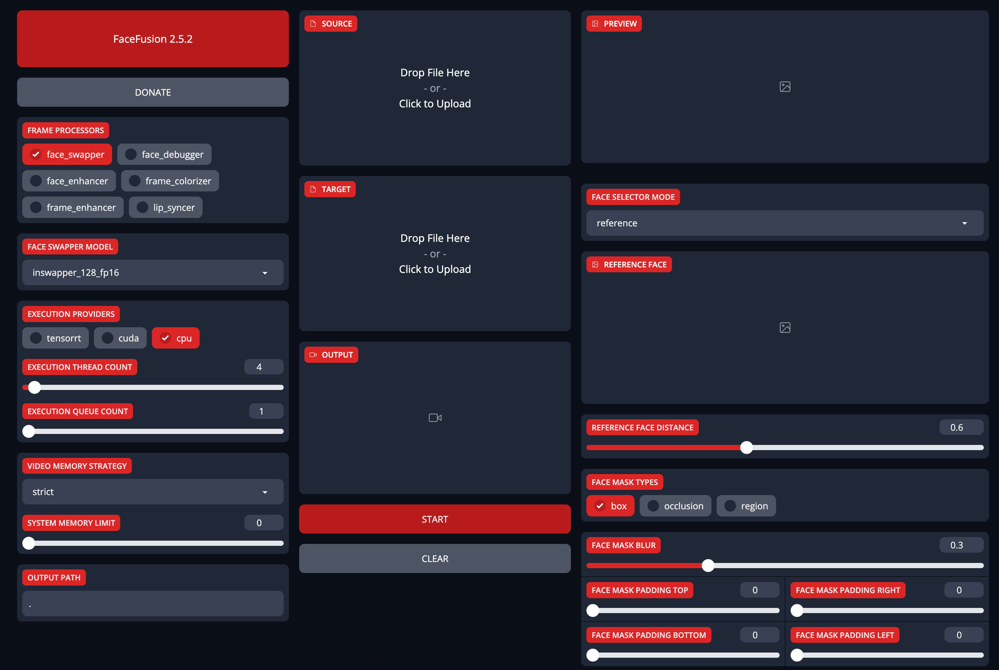

# FaceFusion系列1: AI换脸安装指南

**FaceFusion**，新一代的AI换脸和人脸增强工具。自从**Deepfacelive**停止更新之后，越来越多的用户开始寻找稳定更新的AI换脸技术，而这其中**Facefusion**以其用户友好的界面和卓越的性能成为了新宠。本篇博文会详细指导你如何在云GPU上部署最新版的**Facefusion**，并调整各种换脸参数，来完成各种AI人脸替换效果。

## 项目预览


## 准备工作

本教程会带你了解如何准备环境，安装**Facefusion**的Python包，准备素材，并进行参数调整。

我们将利用以下开源代码库：

### Facefusion AI换脸工具

**Facefusion**: Github地址 - [Facefusion GitHub](https://github.com/facefusion/facefusion)

**FaceFusion**，作为全新的一代AI换脸工具，特点是无需复杂安装，一键即可运行，支持去遮挡、高清化、卡通脸替换，同时兼容Nvidia/AMD等各种显卡，非常适合各种平台使用。

## 安装教程

### 配置GPU实例

请点击以下链接，获得详细的交互式指导：[LooPIN流动性池](/docs/quick-start/swap)

**1. LooPIN流动性池：**

首先，访问LooPIN的流动性池（[LooPIN Network Pool](https://loopin.network/pool)），在那里你可以使用$LOOPIN代币来购买GPU时间。例如，选择RTX 3080 GPU，你可以根据自己的需求和预算，在[GPU UserBenchmark](https://gpu.userbenchmark.com/) 中挑选最适合的GPU型号。

**2. 代币兑换GPU资源：**

- 选择你需要的$LOOPIN代币数量。
- 使用滑块选择你需要的GPU数量。
- 确认你的选择并完成交易。

**3. 进入Jupyter Notebook：**

交易完成后，进入**Rented Servers**区域下的**Server**选项，通过远程服务器访问Jupyter Notebook。一般来说，启动实例需要2-4分钟。

**4. 用nvidia-smi验证GPU：**

在Jupyter Notebook中，打开一个新的终端窗口，执行nvidia-smi命令，以确认GPU已被正确激活。

```shell
+-----------------------------------------------------------------------------------------+
| NVIDIA-SMI 550.54.15              Driver Version: 550.54.15      CUDA Version: 12.4     |
|-----------------------------------------+------------------------+----------------------+
| GPU  Name                 Persistence-M | Bus-Id          Disp.A | Volatile Uncorr. ECC |
| Fan  Temp   Perf          Pwr:Usage/Cap |           Memory-Usage | GPU-Util  Compute M. |
|                                         |                        |               MIG M. |
|=========================================+========================+======================|
|   0  NVIDIA GeForce RTX 3080        Off |   00000000:01:00.0 Off |                  N/A |
|  0%   39C    P8             21W /  350W |      12MiB /  12288MiB |      0%      Default |
|                                         |                        |                  N/A |
+-----------------------------------------+------------------------+----------------------+

+-----------------------------------------------------------------------------------------+
| Processes:                                                                              |
|  GPU   GI   CI        PID   Type   Process name                              GPU Memory |
|        ID   ID                                                               Usage      |
|=========================================================================================|
+-----------------------------------------------------------------------------------------+
```

### 安装`Facefusion`相关依赖

1. 安装`ffmpeg`

```shell
apt update && apt install ffmpeg
```

2. 安装`conda`

```shell
curl -LO https://repo.anaconda.com/miniconda/Miniconda3-latest-Linux-x86_64.sh
bash Miniconda3-latest-Linux-x86_64.sh
```

安装完`conda`后，为了使设置生效，需要重启你的终端。

3. 下载`Facefusion`最新版本

```shell
git clone https://github.com/facefusion/facefusion
cd facefusion
```

4. 安装`Facefusion`依赖

```shell
python install.py
```

在安装过程中，根据本教程，我们选择最新的`onnxruntime`版本，即`cuda-12.2`。

### 启动`Gradio`内网穿透

Gradio是一个用于创建机器学习模型交互式界面的Python库。通过Gradio，你可以为你的模型快速构建一个可视化的、易于使用的Web界面，无需编写任何前端代码。我们将通过Gradio将内网端口7860映射到公网上。

在`facefusion/uis/layouts/`目录下新建文件`share.py`

```python
import gradio

from facefusion.uis.layouts import default


def pre_check() -> bool:
    return default.pre_check()


def pre_render() -> bool:
    return default.pre_render()


def render() -> gradio.Blocks:
    return default.render()


def listen() -> None:
    default.listen()


def run(ui : gradio.Blocks) -> None:
    ui.launch(show_api = False, share = True)
```

返回到`facefusion`目录下，重新启动`run.py`

```shell
python run.py --ui-layouts share
```

完成后，你会看到以下信息：

```shell
Running on local URL: http://127.0.0.1:7860
Running on public URL: https://e41b4898c4fad7cc83.gradio.live

This share link expires in 72 hours. For free permanent hosting and GPU upgrades, run `gradio deploy` from Terminal to deploy to Spaces (https://huggingface.co/spaces)
```

现在，你可以通过你的独特的URL连接访问**Facefusion**界面。



在下一个教程中，我们将介绍**Facefusion**的基本操作和设置，完成一键换脸。

## 总结

- **AI换脸工具：** 介绍了**FaceFusion**作为新一代的AI换脸和人脸增强工具，特点包括用户友好的界面和卓越的性能。
- **安装教程：** 分步骤指导用户如何配置GPU实例，安装和启动**FaceFusion**，包括环境配置、**conda**安装、**ffmpeg**安装、下载和安装**FaceFusion**依赖。
- **GPU配置：** 通过LooPIN流动性池购买GPU时间，使用$LOOPIN代币，并验证GPU激活状态。
- **内网穿透与公网接入：** 介绍了如何使用**Gradio**进行内网穿透，使**FaceFusion**服务能够在公网上访问。

`本文更新于 2024年5月1日`