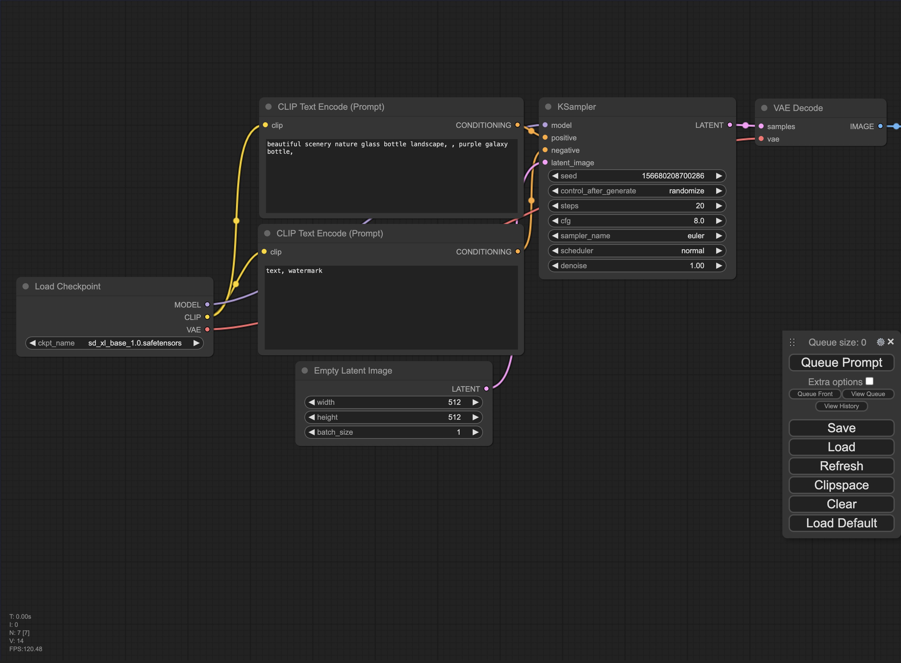
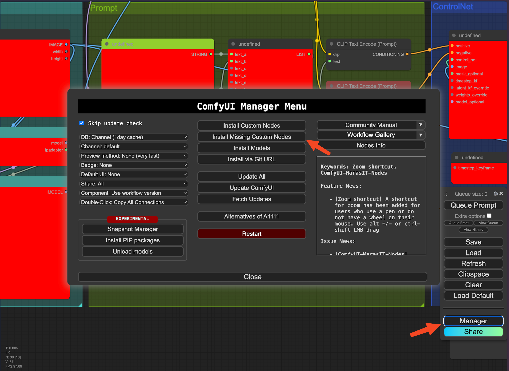
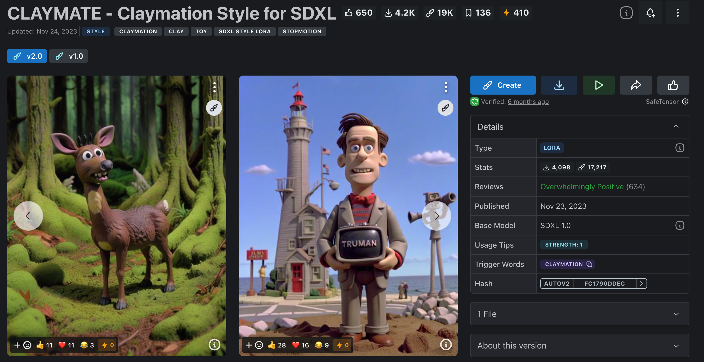
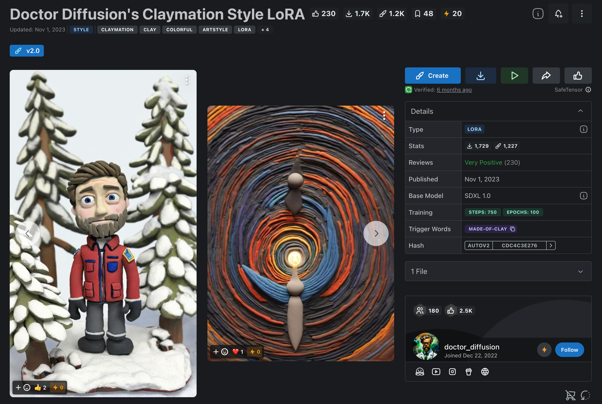
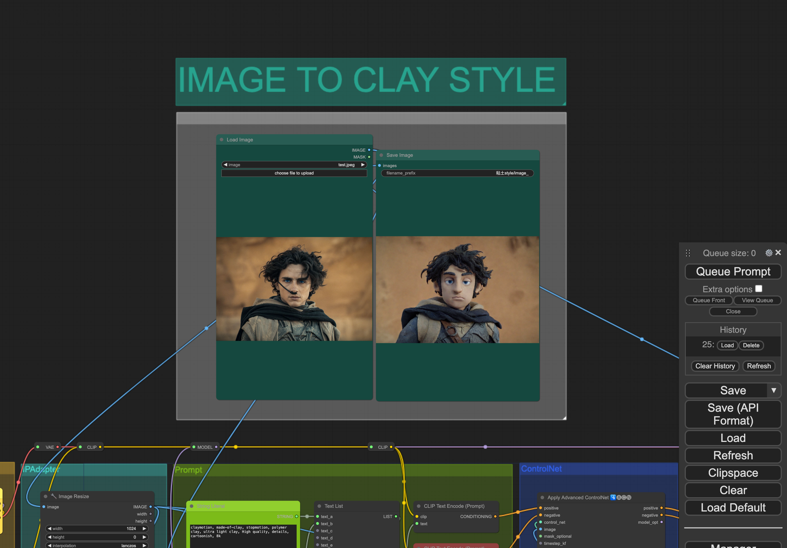

# ComfyUI | 如何复刻粘土风格滤镜

如何在`LooPIN`上一键部署`Stable Diffusion`的`Comfy UI`，以及初步体验使用粘土风格滤镜。`Comfy UI`采用节点化操作，可控性更高，更容易复现和微调出图结果，熟练之后还可以定制个性化工作流。

> 🔥NEW🔥 如果你想先试试效果，可以先使用我们的AI粘土风格滤镜: 👉🏻 <a href="/playground/comfyui-clay-demo" target="_blank">Clay Style Demo</a>


## ComfyUI 简介

`Comfy UI`采用节点化操作。与其他WebUI相比，它目前对`Stable Diffusion XL 1.0`模型的支持更好，可以在工作流中直观看到使用不同模型（如Base模型、Refiner精炼模型）生成的效果图。节点化的操作方式带来了更高的可控性，便于复现和微调出图结果，熟练后还能定制个性化的工作流程。


## ComfyUI 节点安装

### 配置GPU实例

请访问以下页面，获得详细的交互式指导：[LooPIN流动性池](/docs/quick-start/swap)

**1. LooPIN流动性池：**

前往LooPIN的流动性池（[LooPIN Network Pool](https://loopin.network/pool)），使用$LOOPIN代币购买GPU时间。以RTX 3080 GPU为例，根据自身需求和预算，在[GPU UserBenchmark](https://gpu.userbenchmark.com/) 中选择合适的GPU型号。

**2. 代币兑换GPU资源：**

- 选择所需的$LOOPIN代币数量。
- 通过滑块选择GPU数量。
- 确认兑换量并完成交易。

**3. 进入Jupyter Notebook：**

交易成功后，进入**Rented Servers**下的**Server**区域，通过你的远程服务器访问Jupyter Notebook。通常，实例启动需要2-4分钟。

**4. 用nvidia-smi验证GPU：**

在Jupyter Notebook中，打开新的终端窗口，运行nvidia-smi命令，检查GPU是否已激活。

```shell
+-----------------------------------------------------------------------------------------+
| NVIDIA-SMI 550.54.15              Driver Version: 550.54.15      CUDA Version: 12.4     |
|-----------------------------------------+------------------------+----------------------+
| GPU  Name                 Persistence-M | Bus-Id          Disp.A | Volatile Uncorr. ECC |
| Fan  Temp   Perf          Pwr:Usage/Cap |           Memory-Usage | GPU-Util  Compute M. |
|                                         |                        |               MIG M. |
|=========================================+========================+======================|
|   0  NVIDIA GeForce RTX 3080        Off |   00000000:01:00.0 Off |                  N/A |
|  0%   39C    P8             21W /  350W |      12MiB /  12288MiB |      0%      Default |
|                                         |                        |                  N/A |
+-----------------------------------------+------------------------+----------------------+

+-----------------------------------------------------------------------------------------+
| Processes:                                                                              |
|  GPU   GI   CI        PID   Type   Process name                              GPU Memory |
|        ID   ID                                                               Usage      |
|=========================================================================================|
+-----------------------------------------------------------------------------------------+
```

### ComfyUI 安装流程

1. 安装`Comfy UI` github包

```shell
git clone https://github.com/comfyanonymous/ComfyUI.git && cd ComfyUI
```

2. 安装python依赖

```shell
pip install xformers!=0.0.18 -r requirements.txt --extra-index-url https://download.pytorch.org/whl/cu121 --extra-index-url https://download.pytorch.org/whl/cu118 --extra-index-url https://download.pytorch.org/whl/cu117
```

3. 安装`ComfyUI-manager`

`ComfyUI-Manager` 是一个用来提升 `Comfy UI `用户体验的扩展。它带有一套管理功能，可以用来安装、移除、禁用以及启用 `Comfy UI` 的各类定制节点。

```shell
cd /workspace/ComfyUI/custom_nodes
git clone https://github.com/ltdrdata/ComfyUI-Manager.git
```

4. 下载Cloudflare tunnel

```shell
wget https://github.com/cloudflare/cloudflared/releases/latest/download/cloudflared-linux-amd64.deb
dpkg -i cloudflared-linux-amd64.deb
```

5. 在`Comfy UI`下新建`Jupyter Notebook`，使用`Cloudflare`暴露端口

```python
import subprocess
import threading
import time
import socket
import urllib.request

def iframe_thread(port):
  while True:
      time.sleep(0.5)
      sock = socket.socket(socket.AF_INET, socket.SOCK_STREAM)
      result = sock.connect_ex(('127.0.0.1', port))
      if result == 0:
        break
      sock.close()
  print("\nComfyUI finished loading, trying to launch cloudflared (if it gets stuck here cloudflared is having issues)\n")

  p = subprocess.Popen(["cloudflared", "tunnel", "--url", "http://127.0.0.1:{}".format(port)], stdout=subprocess.PIPE, stderr=subprocess.PIPE)
  for line in p.stderr:
    l = line.decode()
    if "trycloudflare.com " in l:
      print("This is the URL to access ComfyUI:", l[l.find("http"):], end='')
    #print(l, end='')


threading.Thread(target=iframe_thread, daemon=True, args=(8188,)).start()

!python main.py --dont-print-server
```

等待`Cloudflare`输出内网穿透的连接

```shell
xformers version: 0.0.26.post1+cu118
Set vram state to: NORMAL_VRAM
Device: cuda:0 NVIDIA GeForce RTX 3080 : cudaMallocAsync
VAE dtype: torch.bfloat16
Using pytorch cross attention
****** User settings have been changed to be stored on the server instead of browser storage. ******
****** For multi-user setups add the --multi-user CLI argument to enable multiple user profiles. ******

Import times for custom nodes:
   0.0 seconds: /workspace/ComfyUI/custom_nodes/websocket_image_save.py


ComfyUI finished loading, trying to launch cloudflared (if it gets stuck here cloudflared is having issues)

This is the URL to access ComfyUI: https://inside-isa-myrtle-guardian.trycloudflare.com
```

点击这个链接即可进入ComfyUI `https://inside-isa-myrtle-guardian.trycloudflare.com`，如果加载不出来，一般需要等待1-2min



### 粘土风格工作流安装

1. 加载粘土风格工作流

我们采用`XIONGMU`的开源的`Comfy UI`工作流 (https://openart.ai/workflows/xiongmu/image-to-clay-style/KRjSiOFyPSHO5QCQ4raV)

点击下载后，在`Comfy UI`选择Load加载



此时因为很多节点我们还没安装，所以报错，此时打开右下角的Manager，点击`Install Missing Custom Nodes`，然后一个个点击`Install`即可全部安装（此教程中共有11个custom node需要安装），安装完成后点击`restart`可重启`Comfy UI`

2. 下载`Checkpoint`基础模型

我们在这使用`https://huggingface.co/RunDiffusion/Juggernaut-XL-v9/resolve/main/Juggernaut-XL_v9_RunDiffusionPhoto_v2.safetensors?download=true`

> 中国用户请将`https://huggingface.co`替换成`https://hf-mirror.com/`

```
wget https://huggingface.co/RunDiffusion/Juggernaut-XL-v9/resolve/main/Juggernaut-XL_v9_RunDiffusionPhoto_v2.safetensors -O /workspace/ComfyUI/models/checkpoints/Juggernaut-XL_v9_RunDiffusionPhoto_v2.safetensors
```

3. 下载`Lora`模型

`LoRA`是一种fine tune扩散模型的训练技术。通过对标准的checkpoint模型做微小的修改，可以比checkpoint模型小10到100倍。采用不同的Lora可以将基础模型局部增强，使其生成风格化的图片。

我们这里需要两个Lora

- CLAYMATE - Claymation Style for SDXL



`https://civitai.com/models/208168/claymate-claymation-style-for-sdxl`

- Doctor Diffusion's Claymation Style LoRA



`https://civitai.com/models/181962/doctor-diffusions-claymation-style-lora`

采用如下命令一键下载（我们在`LooPIN`网络提供免费镜像加速）

```shell
wget -c https://files.loopin.network/docs/tutorials/comfyui/DD-made-of-clay-XL-v2.safetensors -O /workspace/ComfyUI/models/loras/DD-made-of-clay-XL-v2.safetensors
wget -c https://files.loopin.network/docs/tutorials/comfyui/CLAYMATE_V2.03_.safetensors -O /workspace/ComfyUI/models/loras/CLAYMATE_V2.03_.safetensors
```

4. 下载Controlnet模型

`ControlNet`的作用是通过添加额外控制条件，来引导Stable Diffusion 按照创作者的创作思路生成图像，从而提升AI 图像生成的可控性和精度。

> 中国用户请将`https://huggingface.co`替换成`https://hf-mirror.com/`

```shell
wget https://huggingface.co/stabilityai/control-lora/resolve/main/control-LoRAs-rank256/control-lora-canny-rank256.safetensors -O /workspace/ComfyUI/models/controlnet/sai_xl_canny_256lora.safetensors
```

5. 下载IPAdapter模型

`IPAdapter`不用训练lora，一张图就能实现风格迁移，还支持多图多特征提取，同时强大的拓展能力还可接入动态prompt矩阵、controlnet等等，这就是IP-Adapter，一种全新的“垫图”方式。

> 中国用户请将`https://huggingface.co`替换成`https://hf-mirror.com/`

```
mkdir /workspace/ComfyUI/models/ipadapter
wget https://huggingface.co/h94/IP-Adapter/resolve/main/sdxl_models/ip-adapter_sdxl_vit-h.safetensors -O /workspace/ComfyUI/models/ipadapter/ip-adapter_sdxl_vit-h.safetensors
wget https://huggingface.co/h94/IP-Adapter/resolve/main/sdxl_models/ip-adapter-plus_sdxl_vit-h.safetensors -O /workspace/ComfyUI/models/ipadapter/ip-adapter-plus_sdxl_vit-h.safetensors
wget https://huggingface.co/h94/IP-Adapter/resolve/main/sdxl_models/ip-adapter-plus-face_sdxl_vit-h.safetensors -O /workspace/ComfyUI/models/ipadapter/ip-adapter-plus-face_sdxl_vit-h.safetensors
wget https://huggingface.co/h94/IP-Adapter/resolve/main/sdxl_models/ip-adapter_sdxl.safetensors -O /workspace/ComfyUI/models/ipadapter/ip-adapter_sdxl.safetensors
```

6. 下载ClipVision模型

> 中国用户请将`https://huggingface.co`替换成`https://hf-mirror.com/`

```
wget https://huggingface.co/h94/IP-Adapter/resolve/main/models/image_encoder/model.safetensors -O /workspace/ComfyUI/models/clip_vision/CLIP-ViT-H-14-laion2B-s32B-b79K.safetensors && wget https://huggingface.co/h94/IP-Adapter/resolve/main/sdxl_models/image_encoder/model.safetensors -O /workspace/ComfyUI/models/clip_vision/CLIP-ViT-bigG-14-laion2B-39B-b160k.safetensors
```

安装完毕后，点击Manager - Restart 重启 ComfyUI

## 使用ComfyUI生成测试图片



在`ComfyUI`界面，可以看到上方屎粘土风格的图片展示框，为了测试部署是否成功，我们可以：

1. 在Load Image处点击`choose file to upload`上传原始图片
2. 点击右侧的`Queue Prompt`按钮开始生成图片
3. 等待5-10秒左右，生成的图片会显示在界面上

如果图片成功生成，则说明`ComfyUI`已经可以正常使用了。

## 总结与展望

本期教程介绍了如何在LooPIN去中心化GPU云服务器上部署Stable Diffusion的ComfyUI，并初步体验了加载使用粘土风格模型的效果。在后续的教程中，我们将深入探讨ComfyUI的更多玩法和应用。

`本文更新于 2024年5月9日`