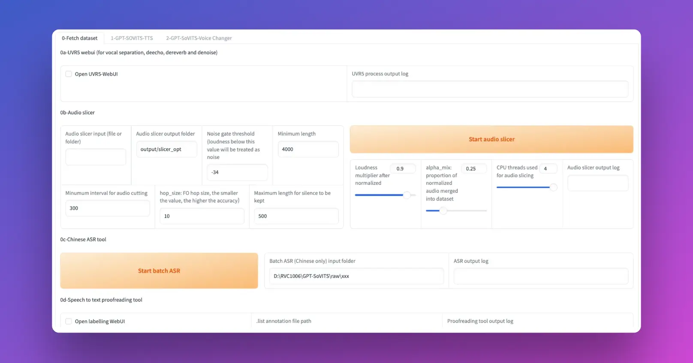

# GPT-SoVITS: 1分钟语音素材AI克隆

`GPT-SoVITS` 是一种功能强大的模型，能够实现少量样本的语音转换和文本到语音的音色克隆。它支持中文、英文和日文的语音推理。开发者的测试显示，只需5秒钟的语音样本，便可实现80%至95%的高度相似的声音克隆。如果提供1分钟的语音样本，其效果能够非常接近真实人声，并能训练出高质量的文本到语音模型。



## 准备工作

本教程将指导你如何安装GPT-SoVITS，在8G显存的显卡上使用1分钟语音片段合成逼真的AI语音

我们将使用以下开源代码库：

### GPT-SoVITS开源语音合成工具

GPT-SoVITS: Github地址 - **[GPT-SoVITS](https://github.com/RVC-Boss/GPT-SoVITS)**

项目特色

1. **零样本文本到语音（TTS）：** 输入 5 秒的声音样本，即刻体验文本到语音转换。
2. **少样本 TTS：** 仅需 1 分钟的训练数据即可微调模型，提升声音相似度和真实感。
3. **跨语言支持：** 支持与训练数据集不同语言的推理，目前支持英语、日语和中文。
4. **WebUI 工具：** 集成工具包括声音伴奏分离、自动训练集分割、中文自动语音识别(ASR)和文本标注，协助初学者创建训练数据集和 GPT/SoVITS 模型。

## 开始安装GPT-SoVITS

### 配置GPU实例

请访问以下页面，获得详细的交互式指导：[LooPIN流动性池](/docs/quick-start/swap)

**1. LooPIN流动性池：**

前往LooPIN的流动性池（[LooPIN Network Pool](https://loopin.network/pool)），使用$LOOPIN代币购买GPU时间。以RTX 3080 GPU为例，根据自身需求和预算，在[GPU UserBenchmark](https://gpu.userbenchmark.com/) 中选择合适的GPU型号。

**2. 代币兑换GPU资源：**

- 选择所需的$LOOPIN代币数量。
- 通过滑块选择GPU数量。
- 确认兑换量并完成交易。

**3. 进入Jupyter Notebook：**

交易成功后，进入**Rented Servers**下的**Server**区域，通过你的远程服务器访问Jupyter Notebook。通常，实例启动需要2-4分钟。

**4. 用nvidia-smi验证GPU：**

在Jupyter Notebook中，打开新的终端窗口，运行nvidia-smi命令，检查GPU是否已激活。

```shell
+-----------------------------------------------------------------------------------------+
| NVIDIA-SMI 550.54.15              Driver Version: 550.54.15      CUDA Version: 12.4     |
|-----------------------------------------+------------------------+----------------------+
| GPU  Name                 Persistence-M | Bus-Id          Disp.A | Volatile Uncorr. ECC |
| Fan  Temp   Perf          Pwr:Usage/Cap |           Memory-Usage | GPU-Util  Compute M. |
|                                         |                        |               MIG M. |
|=========================================+========================+======================|
|   0  NVIDIA GeForce RTX 3080        Off |   00000000:01:00.0 Off |                  N/A |
|  0%   39C    P8             21W /  350W |      12MiB /  12288MiB |      0%      Default |
|                                         |                        |                  N/A |
+-----------------------------------------+------------------------+----------------------+

+-----------------------------------------------------------------------------------------+
| Processes:                                                                              |
|  GPU   GI   CI        PID   Type   Process name                              GPU Memory |
|        ID   ID                                                               Usage      |
|=========================================================================================|
+-----------------------------------------------------------------------------------------+
```

### 安装GPT-SoVITS开源框架

手动安装GPT-SoVITS需要以下依赖软件:

- `Python` 3.10.6
- `FFMPEG` 16.0
- `CUDA` >11.8

依赖软件安装好以后，按以下步骤手动安装`GPT-SoVITS`:

1. 打开Linux Terminal，切换到要安装`GPT-SoVITS`的目录
2. 安装`Miniconda`

```
curl -LO https://repo.anaconda.com/miniconda/Miniconda3-latest-Linux-x86_64.sh
bash Miniconda3-latest-Linux-x86_64.sh
```

3. 复制项目克隆指令,在Terminal中执行:

```
git clone https://github.com/RVC-Boss/GPT-SoVITS
```

4. 复制切换目录指令,在Terminal中执行:

```
cd GPT-SoVITS
```

5. 复制Linux安装指令,在Terminal中执行:

```
conda create -n GPTSoVits python=3.9
conda activate GPTSoVits
bash install.sh
```

在安装过程中一直允许 `Proceed ([y]/n)?`，输入`y`可继续安装

到这里`GPT-SoVITS`程序就安装好了,接下来是手动下载需要用到的模型文件:

```shell
cd /workspace/GPT-SoVITS/GPT_SoVITS/pretrained_models
git clone https://huggingface.co/lj1995/GPT-SoVITS
# 如果是中国地区使用 git clone https://hf-mirror.com/lj1995/GPT-SoVITS
mkdir damo_asr && mkdir damo_asr/models && cd /workspace/GPT-SoVITS/tools/damo_asr/models
git clone https://www.modelscope.cn/damo/speech_paraformer-large_asr_nat-zh-cn-16k-common-vocab8404-pytorch.git
git clone https://www.modelscope.cn/damo/speech_fsmn_vad_zh-cn-16k-common-pytorch.git
git clone https://www.modelscope.cn/damo/punc_ct-transformer_zh-cn-common-vocab272727-pytorch.git
cd /workspace/GPT-SoVITS/tools/uvr5 && rm -r uvr5_weights
git clone https://huggingface.co/Delik/uvr5_weights
# 如果是中国地区使用 git clone https://hf-mirror.com/Delik/uvr5_weights
git config core.sparseCheckout true
mv /workspace/GPT-SoVITS/GPT_SoVITS/pretrained_models/GPT-SoVITS/* /workspace/GPT-SoVITS/GPT_SoVITS/pretrained_models/
```

最后运行webui:

```shell
cd /workspace/GPT-SoVITS/ && python webui.py
```

我们将在后续教程继续介绍如何使用`GPT-SoVITS`

## 总结

`GPT-SoVITS`是一款功能强大,操作简单的AI语音克隆工具:

- 采用GPT机制和参考音频提示,解决了传统语音克隆的声音泄露问题
- 生成的语音在音质和真实度上表现出色
- 支持中英日三种语言
- 开源免费,有整合包一键安装,也可以手动部署
- 容易上手,适合初学者使用

即使只用几分钟的音频素材进行训练,也能合成非常逼真的语音克隆效果。在目前所有开源免费的语音克隆AI中，`GPT-SoVITS`综合表现最好

`本文更新于 2024年5月7日`